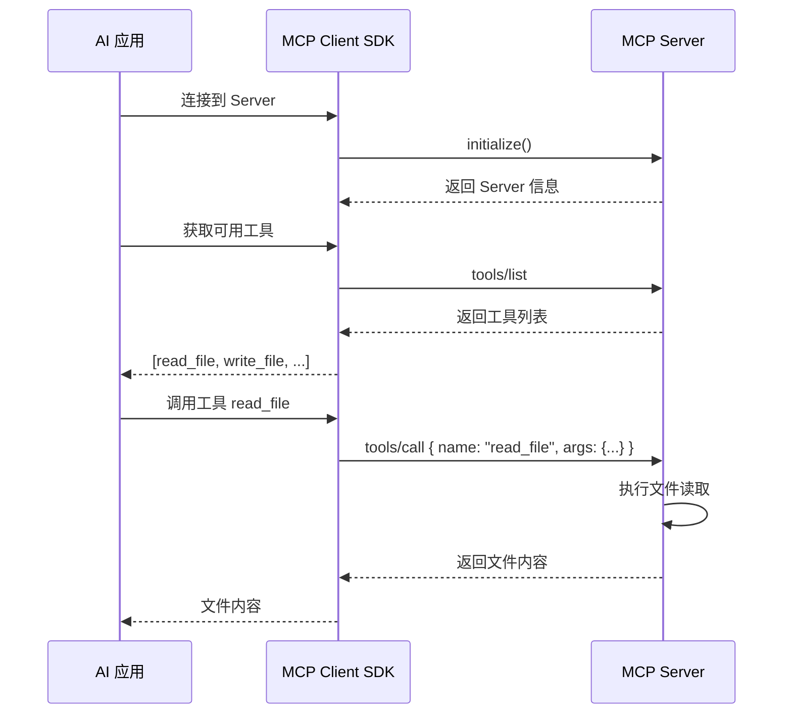

# MCP (Model Context Protocol) 协议详解

> **什么是 MCP？为什么 AionUi 需要它？**

---

## 1. MCP 是什么？

### 1.1 官方定义

**MCP (Model Context Protocol)** 是由 Anthropic 公司开发的一个**开放标准协议**，用于在 AI 应用和外部数据源/工具之间建立标准化的连接。

```
┌─────────────────┐
│   AI 应用        │  (如 AionUi、Claude Desktop)
│   (Client)      │
└────────┬────────┘
         │ MCP 协议
         │ (标准化通信)
         │
┌────────▼────────┐
│  MCP Server     │  (提供工具和数据)
│  - 文件系统      │
│  - 数据库        │
│  - API 服务      │
│  - 浏览器控制    │
└─────────────────┘
```

### 1.2 通俗理解

把 MCP 想象成 **AI 的"USB 接口"**：

- **没有 MCP 之前**：每个 AI 应用都要自己实现文件读取、数据库访问、API 调用等功能
- **有了 MCP 之后**：只需"插入"一个 MCP Server，AI 就能立即获得新能力

就像 USB 接口让你可以给电脑插入各种设备（鼠标、键盘、U盘），MCP 让 AI 可以"插入"各种工具和数据源。

---

## 2. MCP 解决了什么问题？

### 2.1 问题场景

假设你想让 AI 助手能够：

- 📁 读取本地文件
- 🗄️ 查询数据库
- 🌐 访问网页内容
- 🔧 控制浏览器
- 📊 读取 Excel 数据

**传统方式**（没有 MCP）：

```typescript
// 每个功能都要自己实现
class MyAIApp {
  readFile() {
    /* 自己实现文件读取 */
  }
  queryDatabase() {
    /* 自己实现数据库查询 */
  }
  fetchWebPage() {
    /* 自己实现网页抓取 */
  }
  controlBrowser() {
    /* 自己实现浏览器控制 */
  }
  // ... 每个功能都要重复造轮子
}
```

**MCP 方式**：

```typescript
// 只需连接到 MCP Server
const mcpClient = new MCPClient();
await mcpClient.connect('filesystem-server');
await mcpClient.connect('database-server');
await mcpClient.connect('browser-server');

// 所有功能立即可用
const tools = await mcpClient.listTools();
// 返回: ['read_file', 'query_db', 'open_browser', ...]
```

### 2.2 核心优势

| 传统方式         | MCP 方式           |
| ---------------- | ------------------ |
| 每个应用重复实现 | 一次实现，到处使用 |
| 功能耦合在应用中 | 功能独立为 Server  |
| 难以扩展新能力   | 插入新 Server 即可 |
| 维护成本高       | 社区共同维护       |

---

## 3. MCP 的工作原理

### 3.1 架构图

```
┌──────────────────────────────────────────────────────────┐
│                    AI 应用 (Client)                       │
│  ┌────────────────────────────────────────────────────┐  │
│  │  MCP Client SDK (@modelcontextprotocol/sdk)       │  │
│  │  - 连接管理                                         │  │
│  │  - 工具发现                                         │  │
│  │  - 请求/响应处理                                    │  │
│  └────────────────┬───────────────────────────────────┘  │
└───────────────────┼──────────────────────────────────────┘
                    │
                    │ MCP 协议 (JSON-RPC 2.0)
                    │
    ┌───────────────┼───────────────┐
    │               │               │
┌───▼────┐    ┌────▼────┐    ┌────▼────┐
│ Server │    │ Server  │    │ Server  │
│   A    │    │    B    │    │    C    │
└────────┘    └─────────┘    └─────────┘
文件系统       数据库         浏览器控制
```

### 3.2 通信流程



### 3.3 传输方式

MCP 支持三种传输方式：

#### 方式 1: stdio (标准输入输出)

```json
{
  "mcpServers": {
    "filesystem": {
      "command": "npx",
      "args": ["-y", "@modelcontextprotocol/server-filesystem", "/path/to/allowed/files"]
    }
  }
}
```

**工作原理**：

- 启动一个子进程
- 通过 stdin/stdout 通信
- 适合本地工具

#### 方式 2: SSE (Server-Sent Events)

```json
{
  "mcpServers": {
    "remote-api": {
      "url": "https://api.example.com/mcp",
      "transport": "sse"
    }
  }
}
```

**工作原理**：

- HTTP 长连接
- 服务器推送事件
- 适合远程服务

#### 方式 3: HTTP

```json
{
  "mcpServers": {
    "rest-api": {
      "url": "https://api.example.com/mcp",
      "transport": "http"
    }
  }
}
```

**工作原理**：

- 标准 HTTP 请求/响应
- 无状态通信
- 适合简单服务

---

## 4. AionUi 中的 MCP 实现

### 4.1 在 AionUi 中的位置

```
AionUi 架构
├── AI 应用层
│   └── GeminiAgent / AcpAgent / CodexAgent
│       └── 调用 MCP 工具
│
├── MCP 客户端层
│   └── @modelcontextprotocol/sdk
│       ├── 连接管理
│       ├── 工具发现
│       └── 请求处理
│
└── MCP 服务器层
    ├── chrome-devtools (浏览器控制)
    ├── filesystem (文件系统)
    ├── database (数据库)
    └── ... (更多 Server)
```

### 4.2 配置示例

```typescript
// AionUi 中的 MCP 配置
// 存储在 ~/.config/AionUi/aionui-config.txt

{
  "mcp.config": [
    {
      "id": "mcp_chrome_devtools",
      "name": "chrome-devtools",
      "description": "Control Chrome browser via DevTools Protocol",
      "enabled": true,
      "transport": {
        "type": "stdio",
        "command": "npx",
        "args": ["-y", "chrome-devtools-mcp@latest"]
      },
      "tools": [
        {
          "name": "navigate_to",
          "description": "Navigate to a URL"
        },
        {
          "name": "screenshot",
          "description": "Take a screenshot"
        },
        {
          "name": "click_element",
          "description": "Click an element"
        }
      ]
    }
  ]
}
```

### 4.3 使用流程

```typescript
// 1. 用户在设置中添加 MCP Server
// src/renderer/pages/settings/McpSettings.tsx
const addMcpServer = async () => {
  await ipcBridge.mcpService.testMcpConnection({
    name: 'chrome-devtools',
    transport: {
      type: 'stdio',
      command: 'npx',
      args: ['-y', 'chrome-devtools-mcp@latest'],
    },
  });
};

// 2. 同步到 AI Agent
// src/process/services/mcpServices/McpProtocol.ts
await ipcBridge.mcpService.syncMcpToAgents({
  mcpServers: [chromeDevtoolsServer],
  agents: [
    { backend: 'gemini-cli', name: 'Gemini' },
    { backend: 'claude-code', name: 'Claude' },
  ],
});

// 3. AI Agent 自动发现并使用工具
// src/agent/gemini/index.ts
const tools = await mcpClient.listTools();
// AI 决定调用工具
await mcpClient.callTool('navigate_to', { url: 'https://example.com' });
```

---

## 5. 常见的 MCP Server

### 5.1 官方 Server

| Server          | 功能         | 安装命令                                       |
| --------------- | ------------ | ---------------------------------------------- |
| **filesystem**  | 文件系统访问 | `npx @modelcontextprotocol/server-filesystem`  |
| **github**      | GitHub API   | `npx @modelcontextprotocol/server-github`      |
| **google-maps** | Google Maps  | `npx @modelcontextprotocol/server-google-maps` |
| **postgres**    | PostgreSQL   | `npx @modelcontextprotocol/server-postgres`    |
| **puppeteer**   | 浏览器自动化 | `npx @modelcontextprotocol/server-puppeteer`   |

### 5.2 社区 Server

| Server              | 功能              | 仓库                                                                  |
| ------------------- | ----------------- | --------------------------------------------------------------------- |
| **chrome-devtools** | Chrome 浏览器控制 | [chrome-devtools-mcp](https://github.com/example/chrome-devtools-mcp) |
| **sqlite**          | SQLite 数据库     | [mcp-server-sqlite](https://github.com/example/mcp-server-sqlite)     |
| **aws**             | AWS 服务          | [mcp-server-aws](https://github.com/example/mcp-server-aws)           |
| **slack**           | Slack 集成        | [mcp-server-slack](https://github.com/example/mcp-server-slack)       |

### 5.3 在 AionUi 中使用

```bash
# 1. 测试 MCP Server
npx -y chrome-devtools-mcp@latest

# 2. 在 AionUi 设置中添加
# 设置 -> MCP 配置 -> 添加服务器
# 名称: chrome-devtools
# 命令: npx
# 参数: -y, chrome-devtools-mcp@latest

# 3. 同步到 AI Agent
# 点击"同步到 Agent"按钮

# 4. 开始使用
# AI 现在可以控制浏览器了！
```

---

## 6. MCP 协议详解

### 6.1 协议格式 (JSON-RPC 2.0)

```json
// 请求
{
  "jsonrpc": "2.0",
  "id": 1,
  "method": "tools/call",
  "params": {
    "name": "read_file",
    "arguments": {
      "path": "/path/to/file.txt"
    }
  }
}

// 响应
{
  "jsonrpc": "2.0",
  "id": 1,
  "result": {
    "content": [
      {
        "type": "text",
        "text": "File content here..."
      }
    ]
  }
}
```

### 6.2 核心方法

| 方法             | 说明         | 示例               |
| ---------------- | ------------ | ------------------ |
| `initialize`     | 初始化连接   | 建立连接时调用     |
| `tools/list`     | 列出可用工具 | 获取工具列表       |
| `tools/call`     | 调用工具     | 执行具体操作       |
| `resources/list` | 列出资源     | 获取可访问的资源   |
| `resources/read` | 读取资源     | 读取文件、数据等   |
| `prompts/list`   | 列出提示词   | 获取预定义提示词   |
| `prompts/get`    | 获取提示词   | 获取具体提示词内容 |

### 6.3 工具定义格式

```typescript
// MCP 工具定义
interface MCPTool {
  name: string;
  description: string;
  inputSchema: {
    type: "object";
    properties: {
      [key: string]: {
        type: string;
        description: string;
      };
    };
    required?: string[];
  };
}

// 示例
{
  "name": "read_file",
  "description": "Read the contents of a file",
  "inputSchema": {
    "type": "object",
    "properties": {
      "path": {
        "type": "string",
        "description": "Path to the file to read"
      }
    },
    "required": ["path"]
  }
}
```

---

## 7. 实战示例：创建自定义 MCP Server

### 7.1 简单的天气 MCP Server

```typescript
// weather-mcp-server.ts
import { Server } from '@modelcontextprotocol/sdk/server/index.js';
import { StdioServerTransport } from '@modelcontextprotocol/sdk/server/stdio.js';

// 创建 MCP Server
const server = new Server(
  {
    name: 'weather-server',
    version: '1.0.0',
  },
  {
    capabilities: {
      tools: {},
    },
  }
);

// 定义工具
server.setRequestHandler('tools/list', async () => {
  return {
    tools: [
      {
        name: 'get_weather',
        description: 'Get current weather for a city',
        inputSchema: {
          type: 'object',
          properties: {
            city: {
              type: 'string',
              description: 'City name',
            },
          },
          required: ['city'],
        },
      },
    ],
  };
});

// 实现工具逻辑
server.setRequestHandler('tools/call', async (request) => {
  if (request.params.name === 'get_weather') {
    const { city } = request.params.arguments;

    // 调用天气 API
    const response = await fetch(`https://wttr.in/${city}?format=j1`);
    const data = await response.json();

    return {
      content: [
        {
          type: 'text',
          text: JSON.stringify(data.current_condition[0]),
        },
      ],
    };
  }

  throw new Error('Unknown tool');
});

// 启动 Server
const transport = new StdioServerTransport();
await server.connect(transport);
```

### 7.2 在 AionUi 中使用

```json
// 添加到 MCP 配置
{
  "name": "weather-server",
  "transport": {
    "type": "stdio",
    "command": "node",
    "args": ["weather-mcp-server.js"]
  }
}
```

### 7.3 AI 使用示例

```
用户: 北京今天天气怎么样？

AI 思考:
1. 发现可用工具: get_weather
2. 调用工具: get_weather({ city: "Beijing" })
3. 获取结果: { temp_C: "15", weather_desc: "Sunny", ... }
4. 生成回复: "北京今天天气晴朗，温度 15°C..."
```

---

## 8. MCP vs 其他方案

### 8.1 对比表

| 方案         | 优点                     | 缺点             | 适用场景         |
| ------------ | ------------------------ | ---------------- | ---------------- |
| **MCP**      | 标准化、可复用、社区支持 | 需要学习协议     | 需要扩展 AI 能力 |
| **直接集成** | 简单直接                 | 代码耦合、难维护 | 简单功能         |
| **插件系统** | 灵活                     | 非标准化         | 特定应用         |
| **API 调用** | 通用                     | 需要自己封装     | 远程服务         |

### 8.2 为什么 AionUi 选择 MCP？

1. **标准化** - 遵循行业标准，兼容其他 AI 应用
2. **可扩展** - 轻松添加新能力，无需修改核心代码
3. **社区生态** - 可以使用社区开发的 MCP Server
4. **解耦设计** - 工具逻辑独立，易于维护
5. **跨平台** - 同一个 MCP Server 可用于多个 AI Agent

---

## 9. 常见问题

### Q1: MCP 和 API 有什么区别？

**API**：

- 通用的接口规范
- 需要自己处理认证、错误、重试等
- 每个 API 格式可能不同

**MCP**：

- 专为 AI 设计的协议
- 标准化的工具发现和调用
- 统一的错误处理和类型定义

### Q2: MCP Server 必须用 Node.js 写吗？

不是！MCP Server 可以用任何语言实现，只要：

- 支持 JSON-RPC 2.0 协议
- 能通过 stdio/HTTP/SSE 通信

示例：

- Python: `mcp-server-python`
- Go: `mcp-server-go`
- Rust: `mcp-server-rust`

### Q3: 如何调试 MCP Server？

```bash
# 1. 直接运行 Server 测试
npx -y chrome-devtools-mcp@latest

# 2. 查看日志
export MCP_DEBUG=1
npx -y chrome-devtools-mcp@latest

# 3. 使用 MCP Inspector
npx @modelcontextprotocol/inspector chrome-devtools-mcp
```

### Q4: MCP 安全吗？

MCP 本身是安全的，但需要注意：

- ✅ 只安装可信的 MCP Server
- ✅ 限制 Server 的文件访问权限
- ✅ 使用沙箱环境运行不可信 Server
- ⚠️ 不要给 Server 过高的系统权限

---

## 10. 总结

### MCP 的核心价值

```
传统方式:
AI 应用 → 自己实现所有功能 → 重复造轮子

MCP 方式:
AI 应用 → MCP Client → MCP Server → 功能即插即用
```

### 在 AionUi 中的作用

1. **扩展 AI 能力** - 让 AI 可以控制浏览器、访问数据库等
2. **标准化集成** - 统一的方式添加新工具
3. **社区生态** - 使用社区开发的 Server
4. **解耦设计** - 工具逻辑独立于核心代码

### 关键要点

- 🔌 **MCP = AI 的 USB 接口** - 即插即用的工具扩展
- 📦 **@modelcontextprotocol/sdk** - 官方 SDK，处理协议细节
- 🛠️ **MCP Server** - 提供具体功能的独立服务
- 🔗 **三种传输方式** - stdio、SSE、HTTP
- 🌍 **开放生态** - 任何人都可以开发 MCP Server

---

## 11. 参考资源

- **官方网站**: https://modelcontextprotocol.io
- **GitHub**: https://github.com/modelcontextprotocol
- **文档**: https://modelcontextprotocol.io/docs
- **Server 列表**: https://github.com/modelcontextprotocol/servers
- **AionUi MCP 配置**: 设置 -> MCP 配置

---

**简单来说**：MCP 让 AI 应用可以像使用 USB 设备一样，轻松"插入"各种工具和数据源，而 `@modelcontextprotocol/sdk` 就是实现这个功能的官方工具包！
