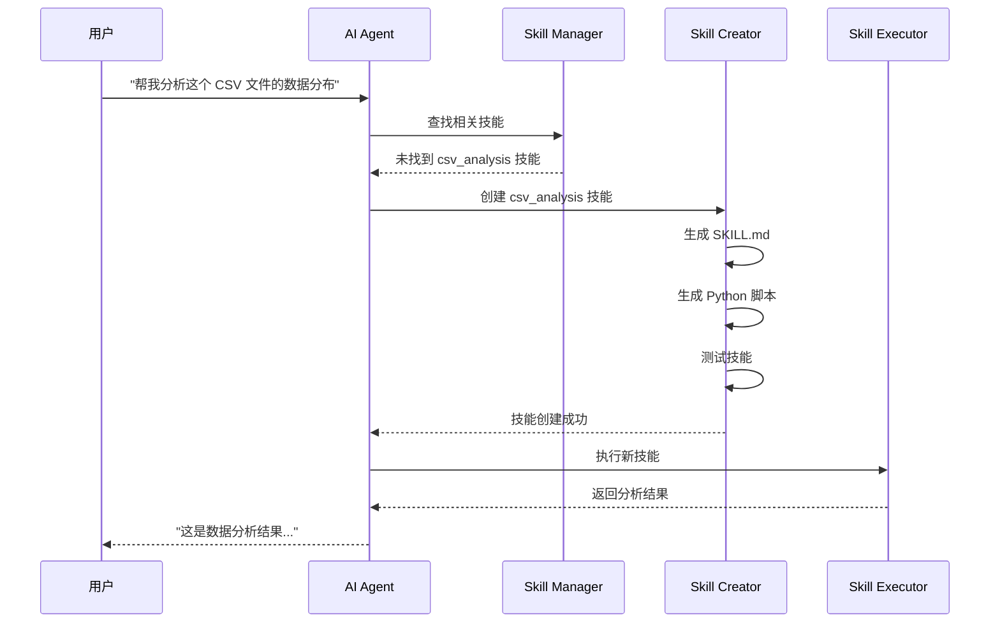

# 动态技能创建系统设计方案

> **目标**: 让 AI 能够根据用户需求自动创建新的 Skill，实现真正的自主扩展能力

---

## 1. 方案概述

### 1.1 核心思路

```
用户需求 → AI 分析 → 检查现有技能 → 技能不存在 → 自动创建技能 → 执行任务
```

### 1.2 工作流程



---

## 2. 实现方案

### 方案 A: 基于现有 skill-creator（推荐）

AionUi 已经内置了 `skill-creator` 技能！我们只需要增强它。

#### 2.1 查看现有实现

```bash
# 查看现有的 skill-creator
ls -la skills/skill-creator/
```

现有结构：

```
skills/skill-creator/
├── SKILL.md           # 技能定义
├── create_skill.py    # 创建技能的脚本
└── templates/         # 技能模板（如果有）
```

#### 2.2 增强方案

我们需要让 AI 能够：

1. **自动检测**技能是否存在
2. **自动决定**是否需要创建新技能
3. **自动创建**并测试技能
4. **自动加载**新技能到当前会话

---

## 3. 详细实现步骤

### 步骤 1: 增强 Skill Creator

#### 创建增强版的技能创建脚本

````python
# skills/skill-creator/auto_create_skill.py
"""
自动技能创建器 - 根据需求描述自动生成技能
"""
import os
import sys
import json
from pathlib import Path

def analyze_requirement(requirement: str) -> dict:
    """
    分析用户需求，提取技能信息

    Args:
        requirement: 用户需求描述

    Returns:
        {
            "skill_name": "csv_analyzer",
            "description": "Analyze CSV file data distribution",
            "language": "python",
            "dependencies": ["pandas", "matplotlib"],
            "input_params": ["file_path"],
            "output_format": "json"
        }
    """
    # 这里可以用简单的规则或者调用 LLM 来分析
    # 为了演示，我们使用简单的关键词匹配

    skill_info = {
        "skill_name": "",
        "description": requirement,
        "language": "python",
        "dependencies": [],
        "input_params": [],
        "output_format": "json"
    }

    # 根据关键词推断技能类型
    if "csv" in requirement.lower() or "excel" in requirement.lower():
        skill_info["skill_name"] = "csv_analyzer"
        skill_info["dependencies"] = ["pandas"]
        skill_info["input_params"] = ["file_path"]
    elif "image" in requirement.lower() or "picture" in requirement.lower():
        skill_info["skill_name"] = "image_processor"
        skill_info["dependencies"] = ["pillow"]
        skill_info["input_params"] = ["image_path"]
    elif "api" in requirement.lower() or "http" in requirement.lower():
        skill_info["skill_name"] = "api_caller"
        skill_info["dependencies"] = ["requests"]
        skill_info["input_params"] = ["url", "method"]
    else:
        # 通用技能
        skill_info["skill_name"] = "custom_task"
        skill_info["input_params"] = ["input_data"]

    return skill_info


def generate_skill_md(skill_info: dict) -> str:
    """生成 SKILL.md 内容"""

    params_doc = "\n".join([
        f"- `{param}`: Description of {param}"
        for param in skill_info["input_params"]
    ])

    deps_doc = ", ".join(skill_info["dependencies"]) if skill_info["dependencies"] else "None"

    return f"""---
name: {skill_info["skill_name"]}
description: {skill_info["description"]}
auto_generated: true
created_at: {import_datetime()}
---

# {skill_info["skill_name"].replace('_', ' ').title()}

{skill_info["description"]}

## Tools

### {skill_info["skill_name"]}.py

**Location:** `skills/{skill_info["skill_name"]}/{skill_info["skill_name"]}.py`

**Dependencies:** {deps_doc}

**Usage:**
```bash
python skills/{skill_info["skill_name"]}/{skill_info["skill_name"]}.py <args>
````

**Arguments:**
{params_doc}

**Output:**
Returns {skill_info["output_format"].upper()} with the following structure:

```json
{{
  "status": "success",
  "result": "..."
}}
```

**Example:**

```bash
python skills/{skill_info["skill_name"]}/{skill_info["skill_name"]}.py "input"
```

## Notes

This skill was automatically generated. You may need to customize it for your specific use case.
"""

def generate_python_script(skill_info: dict, requirement: str) -> str:
"""生成 Python 脚本内容"""

    # 根据技能类型生成不同的模板
    if "csv" in skill_info["skill_name"]:
        return generate_csv_analyzer_script()
    elif "image" in skill_info["skill_name"]:
        return generate_image_processor_script()
    elif "api" in skill_info["skill_name"]:
        return generate_api_caller_script()
    else:
        return generate_generic_script(skill_info, requirement)

def generate_csv_analyzer_script() -> str:
"""生成 CSV 分析脚本"""
return '''#!/usr/bin/env python3
"""
CSV Analyzer - Analyze CSV file data distribution
Auto-generated skill
"""
import sys
import json
import pandas as pd

def analyze_csv(file_path: str) -> dict:
"""Analyze CSV file and return statistics"""
try: # Read CSV
df = pd.read_csv(file_path)

        # Basic statistics
        result = {
            "status": "success",
            "rows": len(df),
            "columns": len(df.columns),
            "column_names": df.columns.tolist(),
            "data_types": df.dtypes.astype(str).to_dict(),
            "missing_values": df.isnull().sum().to_dict(),
            "numeric_summary": df.describe().to_dict() if len(df.select_dtypes(include=['number']).columns) > 0 else {},
        }

        return result
    except Exception as e:
        return {
            "status": "error",
            "error": str(e)
        }

def main():
if len(sys.argv) < 2:
print(json.dumps({"status": "error", "error": "Missing file_path argument"}))
sys.exit(1)

    file_path = sys.argv[1]
    result = analyze_csv(file_path)
    print(json.dumps(result, indent=2))

if **name** == "**main**":
main()
'''

def generate_generic_script(skill_info: dict, requirement: str) -> str:
"""生成通用脚本模板"""
return f'''#!/usr/bin/env python3
"""
{skill_info["skill_name"]} - {skill_info["description"]}
Auto-generated skill
"""
import sys
import json

def execute_task(input_data: str) -> dict:
"""
Execute the task based on requirement:
{requirement}

    TODO: Implement the actual logic here
    """
    try:
        # TODO: Add your implementation here
        result = {{
            "status": "success",
            "message": "Task completed",
            "input": input_data,
            "output": "TODO: Implement actual logic"
        }}

        return result
    except Exception as e:
        return {{
            "status": "error",
            "error": str(e)
        }}

def main():
if len(sys.argv) < 2:
print(json.dumps({{"status": "error", "error": "Missing input argument"}}))
sys.exit(1)

    input_data = sys.argv[1]
    result = execute_task(input_data)
    print(json.dumps(result, indent=2))

if **name** == "**main**":
main()
'''

def create_skill(requirement: str, skills_dir: str = None) -> dict:
"""
自动创建技能

    Args:
        requirement: 用户需求描述
        skills_dir: 技能目录路径

    Returns:
        创建结果
    """
    # 确定技能目录
    if skills_dir is None:
        skills_dir = Path(__file__).parent.parent
    else:
        skills_dir = Path(skills_dir)

    # 分析需求
    skill_info = analyze_requirement(requirement)
    skill_name = skill_info["skill_name"]

    # 创建技能目录
    skill_dir = skills_dir / skill_name
    if skill_dir.exists():
        return {
            "status": "error",
            "error": f"Skill '{skill_name}' already exists"
        }

    skill_dir.mkdir(parents=True, exist_ok=True)

    # 生成 SKILL.md
    skill_md_content = generate_skill_md(skill_info)
    (skill_dir / "SKILL.md").write_text(skill_md_content)

    # 生成 Python 脚本
    script_content = generate_python_script(skill_info, requirement)
    script_path = skill_dir / f"{skill_name}.py"
    script_path.write_text(script_content)
    script_path.chmod(0o755)  # 添加执行权限

    # 安装依赖（如果需要）
    if skill_info["dependencies"]:
        try:
            import subprocess
            subprocess.run(
                ["pip", "install"] + skill_info["dependencies"],
                check=True,
                capture_output=True
            )
        except Exception as e:
            return {
                "status": "warning",
                "message": f"Skill created but dependencies installation failed: {e}",
                "skill_name": skill_name,
                "skill_path": str(skill_dir)
            }

    return {
        "status": "success",
        "message": f"Skill '{skill_name}' created successfully",
        "skill_name": skill_name,
        "skill_path": str(skill_dir),
        "script_path": str(script_path),
        "usage": f"python {script_path} <args>"
    }

def import_datetime():
"""导入 datetime 并返回当前时间"""
from datetime import datetime
return datetime.now().isoformat()

def main():
if len(sys.argv) < 2:
print(json.dumps({
"status": "error",
"error": "Usage: python auto_create_skill.py '<requirement description>' [skills_dir]"
}))
sys.exit(1)

    requirement = sys.argv[1]
    skills_dir = sys.argv[2] if len(sys.argv) > 2 else None

    result = create_skill(requirement, skills_dir)
    print(json.dumps(result, indent=2))

if **name** == "**main**":
main()

````

#### 更新 SKILL.md

```markdown
<!-- skills/skill-creator/SKILL.md -->
---
name: skill-creator
description: Automatically create new skills based on user requirements
---

# Skill Creator

This skill allows the AI to automatically create new skills when needed.

## Tools

### auto_create_skill.py

**Location:** `skills/skill-creator/auto_create_skill.py`

**Usage:**
```bash
python skills/skill-creator/auto_create_skill.py "<requirement description>" [skills_dir]
````

**Arguments:**

- `requirement`: Description of what the skill should do
- `skills_dir`: (Optional) Path to skills directory

**Output:**
Returns JSON with:

```json
{
  "status": "success",
  "skill_name": "csv_analyzer",
  "skill_path": "/path/to/skills/csv_analyzer",
  "script_path": "/path/to/skills/csv_analyzer/csv_analyzer.py",
  "usage": "python /path/to/skills/csv_analyzer/csv_analyzer.py <args>"
}
```

**Example:**

```bash
python skills/skill-creator/auto_create_skill.py "Analyze CSV file data distribution"
```

## Workflow

1. AI detects that a required skill doesn't exist
2. AI calls `auto_create_skill.py` with the requirement description
3. Script analyzes the requirement and generates:
   - SKILL.md (skill definition)
   - Python script (implementation)
4. AI can immediately use the new skill
5. User can customize the generated skill if needed

## Supported Skill Types

- **CSV/Excel Analysis**: Automatically generates pandas-based analyzers
- **Image Processing**: Generates PIL/Pillow-based processors
- **API Calling**: Generates requests-based API clients
- **Generic Tasks**: Generates customizable templates

## Notes

- Generated skills may need customization for complex requirements
- AI should inform the user when a new skill is created
- Users can manually edit generated skills in the `skills/` directory

````

---

### 步骤 2: 增强 AI Agent 的技能检测逻辑

#### 修改 GeminiAgent 添加自动技能创建

```typescript
// src/agent/gemini/index.ts
export class GeminiAgent {
  private enabledSkills: string[];
  private skillsDir: string;
  private autoCreateSkills: boolean = true; // 新增：是否自动创建技能

  async send(message: string): Promise<void> {
    // 在发送消息前，检查是否需要创建新技能
    if (this.autoCreateSkills) {
      await this.checkAndCreateSkills(message);
    }

    // 原有的发送逻辑
    // ...
  }

  private async checkAndCreateSkills(message: string): Promise<void> {
    // 1. 分析消息，判断是否需要新技能
    const needsNewSkill = await this.analyzeSkillRequirement(message);

    if (needsNewSkill) {
      // 2. 调用 skill-creator 创建技能
      const result = await this.createSkill(needsNewSkill.requirement);

      if (result.status === 'success') {
        // 3. 动态加载新技能
        await this.loadNewSkill(result.skill_name);

        // 4. 通知用户
        this.emit('skill-created', {
          skill_name: result.skill_name,
          message: `Created new skill: ${result.skill_name}`,
        });
      }
    }
  }

  private async analyzeSkillRequirement(message: string): Promise<{ requirement: string } | null> {
    // 简单的关键词检测
    // 实际应用中可以用 LLM 来分析

    const keywords = {
      csv: /analyze.*csv|csv.*analysis|parse.*csv/i,
      image: /process.*image|edit.*picture|convert.*image/i,
      api: /call.*api|fetch.*data|http.*request/i,
    };

    for (const [type, pattern] of Object.entries(keywords)) {
      if (pattern.test(message)) {
        // 检查是否已有相关技能
        const hasSkill = this.enabledSkills.some(skill =>
          skill.includes(type) || skill.includes('analyzer')
        );

        if (!hasSkill) {
          return { requirement: message };
        }
      }
    }

    return null;
  }

  private async createSkill(requirement: string): Promise<any> {
    // 调用 skill-creator
    const { spawn } = require('child_process');

    return new Promise((resolve, reject) => {
      const process = spawn('python', [
        `${this.skillsDir}/skill-creator/auto_create_skill.py`,
        requirement,
        this.skillsDir,
      ]);

      let output = '';
      process.stdout.on('data', (data: Buffer) => {
        output += data.toString();
      });

      process.on('close', (code: number) => {
        if (code === 0) {
          try {
            const result = JSON.parse(output);
            resolve(result);
          } catch (e) {
            reject(new Error('Failed to parse skill creation result'));
          }
        } else {
          reject(new Error('Skill creation failed'));
        }
      });
    });
  }

  private async loadNewSkill(skillName: string): Promise<void> {
    // 动态加载新技能到当前会话
    const skillPath = `${this.skillsDir}/${skillName}/SKILL.md`;
    const skillContent = await fs.readFile(skillPath, 'utf-8');

    // 添加到启用的技能列表
    this.enabledSkills.push(skillName);

    // 重新加载技能内容到 System Prompt
    await this.reloadSkills();
  }

  private async reloadSkills(): Promise<void> {
    // 重新加载所有启用的技能
    const { loadSkillsContent } = require('@/process/initStorage');
    const skillsContent = await loadSkillsContent(this.enabledSkills);

    // 更新 System Prompt
    this.systemPrompt = this.buildSystemPrompt(skillsContent);
  }
}
````

---

### 步骤 3: 添加用户界面提示

#### 在前端显示技能创建通知

```typescript
// src/renderer/components/SkillCreationNotification.tsx
import { Message } from '@arco-design/web-react';
import { useEffect } from 'react';
import { ipcBridge } from '@/common/ipcBridge';

export const SkillCreationNotification = () => {
  useEffect(() => {
    // 监听技能创建事件
    const unsubscribe = ipcBridge.geminiConversation.responseStream.subscribe((msg) => {
      if (msg.type === 'skill-created') {
        Message.success({
          content: `🎉 New skill created: ${msg.data.skill_name}`,
          duration: 5000,
        });
      }
    });

    return unsubscribe;
  }, []);

  return null;
};
```

---

### 步骤 4: 添加配置选项

#### 在设置中添加开关

```typescript
// src/renderer/pages/settings/SkillSettings.tsx
import { Switch, Typography } from '@arco-design/web-react';

export const SkillSettings = () => {
  const [autoCreate, setAutoCreate] = useState(true);

  const handleToggle = async (checked: boolean) => {
    setAutoCreate(checked);
    await ipcBridge.config.set('skills.autoCreate', checked);
  };

  return (
    <div>
      <Typography.Title heading={6}>Skill Settings</Typography.Title>

      <div className="setting-item">
        <div>
          <Typography.Text>Auto-create Skills</Typography.Text>
          <Typography.Text type="secondary" style={{ display: 'block', fontSize: '12px' }}>
            Automatically create new skills when needed
          </Typography.Text>
        </div>
        <Switch checked={autoCreate} onChange={handleToggle} />
      </div>
    </div>
  );
};
```

---

## 4. 使用示例

### 场景 1: CSV 分析

```
用户: 帮我分析这个 sales_data.csv 文件的数据分布

AI 思考过程:
1. 检测到需要 CSV 分析功能
2. 检查现有技能 → 未找到 csv_analyzer
3. 调用 skill-creator 创建技能
4. 生成 skills/csv_analyzer/SKILL.md
5. 生成 skills/csv_analyzer/csv_analyzer.py
6. 加载新技能到当前会话
7. 执行: python skills/csv_analyzer/csv_analyzer.py "sales_data.csv"
8. 返回分析结果

AI 回复:
"我刚刚创建了一个 CSV 分析技能来帮你完成这个任务。

分析结果:
- 总行数: 1000
- 列数: 5
- 列名: date, product, quantity, price, total
- 缺失值: 无
- 数值统计: ..."
```

### 场景 2: 图像处理

```
用户: 把这张图片转换成灰度图

AI 思考过程:
1. 检测到需要图像处理功能
2. 检查现有技能 → 未找到 image_processor
3. 自动创建 image_processor 技能
4. 执行图像转换
5. 返回结果

AI 回复:
"我创建了一个图像处理技能，已经将图片转换为灰度图。
保存位置: output_grayscale.png"
```

---

## 5. 高级功能

### 5.1 技能学习和优化

```python
# skills/skill-creator/optimize_skill.py
"""
技能优化器 - 根据使用反馈优化技能
"""

def optimize_skill(skill_name: str, feedback: dict) -> dict:
    """
    根据用户反馈优化技能

    Args:
        skill_name: 技能名称
        feedback: {
            "success": bool,
            "error": str,
            "suggestions": str
        }
    """
    # 读取现有技能
    skill_path = f"skills/{skill_name}/{skill_name}.py"

    # 分析反馈
    if not feedback["success"]:
        # 修复错误
        # 可以调用 LLM 来生成修复代码
        pass

    # 应用优化
    # ...

    return {
        "status": "success",
        "message": "Skill optimized"
    }
```

### 5.2 技能版本管理

```python
# skills/skill-creator/version_manager.py
"""
技能版本管理
"""

def create_skill_version(skill_name: str) -> str:
    """创建技能版本快照"""
    import shutil
    from datetime import datetime

    version = datetime.now().strftime("%Y%m%d_%H%M%S")
    src = f"skills/{skill_name}"
    dst = f"skills/{skill_name}/.versions/{version}"

    shutil.copytree(src, dst)
    return version

def rollback_skill(skill_name: str, version: str) -> bool:
    """回滚到指定版本"""
    import shutil

    src = f"skills/{skill_name}/.versions/{version}"
    dst = f"skills/{skill_name}"

    shutil.rmtree(dst)
    shutil.copytree(src, dst)
    return True
```

### 5.3 技能市场

```typescript
// 未来可以实现技能分享和下载
interface SkillMarketplace {
  search(query: string): Skill[];
  download(skillId: string): Promise<void>;
  publish(skill: Skill): Promise<void>;
  rate(skillId: string, rating: number): Promise<void>;
}
```

---

## 6. 安全考虑

### 6.1 代码审查

```python
# skills/skill-creator/security_checker.py
"""
安全检查器 - 检查生成的代码是否安全
"""

DANGEROUS_PATTERNS = [
    r'os\.system',
    r'subprocess\.call',
    r'eval\(',
    r'exec\(',
    r'__import__',
    r'open\(.*[\'"]w[\'"]',  # 写文件
]

def check_security(code: str) -> dict:
    """检查代码安全性"""
    import re

    issues = []
    for pattern in DANGEROUS_PATTERNS:
        if re.search(pattern, code):
            issues.append(f"Potentially dangerous pattern: {pattern}")

    return {
        "safe": len(issues) == 0,
        "issues": issues
    }
```

### 6.2 沙箱执行

```python
# 在隔离环境中执行新创建的技能
import subprocess

def execute_in_sandbox(script_path: str, args: list) -> dict:
    """在沙箱中执行脚本"""
    try:
        result = subprocess.run(
            ['python', script_path] + args,
            capture_output=True,
            timeout=30,  # 30秒超时
            text=True
        )
        return {
            "status": "success",
            "output": result.stdout
        }
    except subprocess.TimeoutExpired:
        return {
            "status": "error",
            "error": "Execution timeout"
        }
```

---

## 7. 配置和部署

### 7.1 启用自动技能创建

```typescript
// 在会话创建时启用
const conversation = await ipcBridge.conversation.create({
  type: 'gemini',
  model: selectedModel,
  extra: {
    workspace: '/path/to/workspace',
    enabledSkills: ['skill-creator'], // 启用 skill-creator
    autoCreateSkills: true, // 启用自动创建
  },
});
```

### 7.2 环境变量配置

```bash
# .env
AIONUI_AUTO_CREATE_SKILLS=true
AIONUI_SKILLS_DIR=/path/to/skills
AIONUI_MAX_SKILL_CREATION_PER_SESSION=5
```

---

## 8. 测试

### 8.1 单元测试

```python
# tests/test_skill_creator.py
import unittest
from skills.skill_creator.auto_create_skill import create_skill

class TestSkillCreator(unittest.TestCase):
    def test_create_csv_analyzer(self):
        result = create_skill("Analyze CSV file data distribution")
        self.assertEqual(result["status"], "success")
        self.assertIn("csv", result["skill_name"])

    def test_create_image_processor(self):
        result = create_skill("Convert image to grayscale")
        self.assertEqual(result["status"], "success")
        self.assertIn("image", result["skill_name"])
```

### 8.2 集成测试

```typescript
// tests/integration/skill-creation.test.ts
describe('Auto Skill Creation', () => {
  it('should create skill when needed', async () => {
    const agent = new GeminiAgent({
      autoCreateSkills: true,
      enabledSkills: ['skill-creator'],
    });

    await agent.send('Analyze this CSV file');

    // 验证技能已创建
    const skills = await listSkills();
    expect(skills).toContain('csv_analyzer');
  });
});
```

---

## 9. 总结

### 实现要点

1. ✅ **利用现有 skill-creator** - AionUi 已有基础
2. ✅ **增强自动检测** - AI 自动判断是否需要新技能
3. ✅ **动态加载** - 创建后立即可用
4. ✅ **用户通知** - 告知用户技能创建
5. ✅ **安全检查** - 防止恶意代码

### 优势

- 🚀 **真正的自主扩展** - AI 可以自己学习新能力
- 🎯 **按需创建** - 只在需要时创建，不浪费资源
- 🔄 **持续优化** - 可以根据反馈改进技能
- 📦 **可复用** - 创建的技能可以在未来复用

### 下一步

1. 实现基础的 `auto_create_skill.py`
2. 在 GeminiAgent 中添加检测逻辑
3. 测试几个常见场景
4. 添加用户界面提示
5. 完善安全检查

需要我帮你生成完整的代码文件吗？
