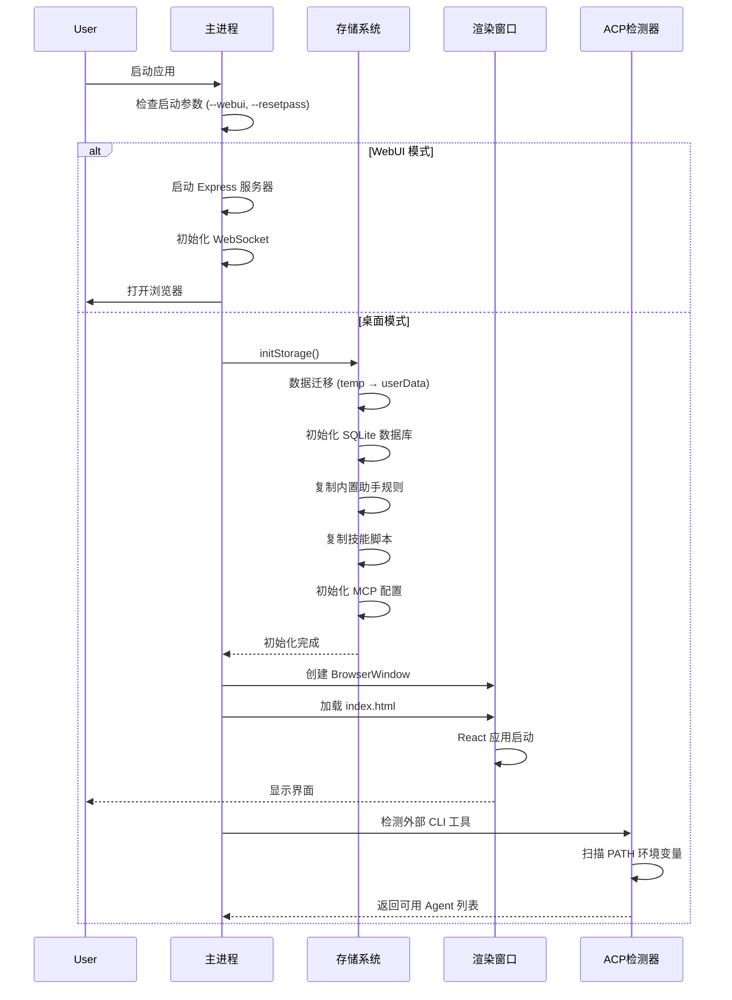
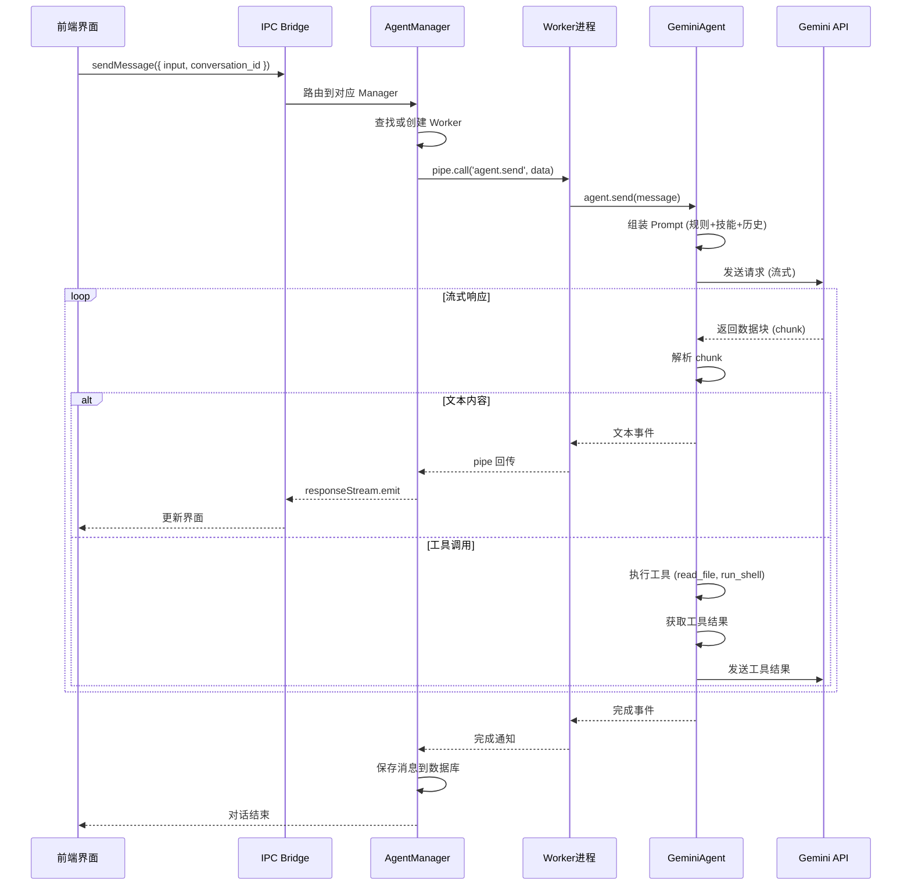
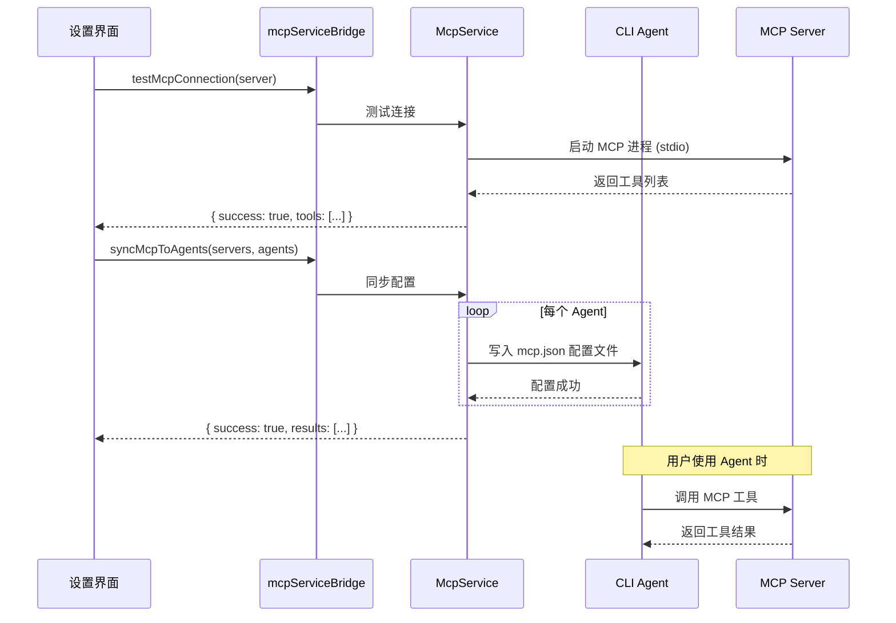

# AionUi 项目架构深度分析文档

> **文档版本**: v1.0  
> **项目版本**: 1.7.2  
> **生成日期**: 2026-01-27  
> **文档类型**: 技术架构分析

---

## 📋 目录

1. [项目概览](#1-项目概览)
2. [核心技术栈](#2-核心技术栈)
3. [系统架构设计](#3-系统架构设计)
4. [目录结构详解](#4-目录结构详解)
5. [核心功能与工作流程](#5-核心功能与工作流程)
6. [关键设计模式](#6-关键设计模式)
7. [数据存储架构](#7-数据存储架构)
8. [扩展开发指南](#8-扩展开发指南)
9. [部署与构建](#9-部署与构建)
10. [性能优化策略](#10-性能优化策略)

---

## 1. 项目概览

### 1.1 项目定位

**AionUi** 是一个基于 Electron 的跨平台桌面应用，旨在为命令行 AI 代理提供现代化的图形界面。它不仅仅是简单的 Shell 包装器，而是通过深度集成实现了：

- 🤖 **多 AI 代理统一管理** - 支持 Gemini CLI、Claude Code、Codex、Qwen Code 等
- 📁 **智能文件管理** - 批量重命名、自动分类、文件合并
- 📄 **多格式预览** - 支持 PDF、Word、Excel、PPT、代码、Markdown 等 9+ 格式
- 🎨 **AI 图像生成** - 集成 Gemini 图像生成能力
- 🌐 **WebUI 远程访问** - 支持浏览器访问，跨设备使用
- 🔧 **技能扩展系统** - 基于文件的插件化能力扩展

### 1.2 核心特性

| 特性           | 说明                                    | 技术实现                    |
| -------------- | --------------------------------------- | --------------------------- |
| **多会话管理** | 支持多个独立对话，互不干扰              | SQLite + 文件存储           |
| **流式响应**   | 实时显示 AI 生成内容                    | IPC Bridge + EventEmitter   |
| **工具调用**   | AI 可执行文件操作、Shell 命令           | Worker Process 隔离执行     |
| **技能系统**   | 可扩展的 Python/JS 脚本能力             | 动态加载 + Frontmatter 解析 |
| **MCP 协议**   | 支持 Model Context Protocol             | stdio/SSE/HTTP 传输         |
| **预设助手**   | 内置多个专业助手（PPT 生成、UI 设计等） | 配置化预设系统              |

---

## 2. 核心技术栈

### 2.1 前端技术

```
React 19.1.0          - UI 框架
Arco Design 2.66.1    - 企业级 UI 组件库
UnoCSS 66.3.3         - 原子化 CSS 引擎
Monaco Editor 4.7.0   - 代码编辑器（VS Code 内核）
React Router 7.8.0    - 路由管理
i18next 23.7.16       - 国际化支持
```

**特色库**:

- `react-markdown` - Markdown 渲染（支持 GFM、数学公式）
- `diff2html` - 代码差异可视化
- `react-virtuoso` - 虚拟滚动优化长列表
- `@floating-ui/react` - 浮动元素定位

### 2.2 主进程技术

```
Electron 37.3.1       - 跨平台桌面框架
Node.js               - 运行时环境
Better-SQLite3 12.4.1 - 嵌入式数据库
Express 5.1.0         - WebUI 服务器
WebSocket (ws 8.18.3) - 实时通信
```

**核心依赖**:

- `@office-ai/aioncli-core` - Gemini CLI 核心 SDK
- `@office-ai/platform` - 平台抽象层（IPC Bridge）
- `@modelcontextprotocol/sdk` - MCP 协议实现

### 2.3 文档处理

```
mammoth 1.11.0        - Word 文档解析
pptx2json 0.0.10      - PowerPoint 解析
xlsx-republish 0.20.3 - Excel 处理
officeparser 5.2.2    - 通用 Office 文档解析
sharp 0.34.3          - 图像处理
```

### 2.4 构建工具

```
Webpack 5             - 模块打包
TypeScript 5.8.3      - 类型系统
Electron Forge 7.8.1  - 打包工具
Electron Builder 26   - 分发构建
ESLint + Prettier     - 代码质量
```

---

## 3. 系统架构设计

### 3.1 整体架构图

```
┌─────────────────────────────────────────────────────────────────┐
│                         用户界面层 (UI Layer)                      │
│  ┌──────────────┐  ┌──────────────┐  ┌──────────────┐          │
│  │  桌面应用     │  │  WebUI 模式   │  │  移动浏览器   │          │
│  │  (Electron)  │  │  (Browser)   │  │  (PWA)      │          │
│  └──────┬───────┘  └──────┬───────┘  └──────┬───────┘          │
└─────────┼──────────────────┼──────────────────┼─────────────────┘
          │                  │                  │
          │    IPC Bridge    │   HTTP/WS API    │
          ▼                  ▼                  ▼
┌─────────────────────────────────────────────────────────────────┐
│                      主进程层 (Main Process)                      │
│  ┌──────────────────────────────────────────────────────────┐  │
│  │                    IPC 路由与处理                          │  │
│  │  • geminiConversationBridge  • acpConversationBridge     │  │
│  │  • fsBridge  • dialogBridge  • mcpServiceBridge          │  │
│  └──────────────────────────────────────────────────────────┘  │
│  ┌──────────────────────────────────────────────────────────┐  │
│  │                    核心服务层                              │  │
│  │  • WorkerManage (进程管理)  • ConfigStorage (配置)        │  │
│  │  • ChatStorage (会话)       • Database (SQLite)          │  │
│  │  • FileWatcher (文件监听)   • McpService (MCP 协议)       │  │
│  └──────────────────────────────────────────────────────────┘  │
│  ┌──────────────────────────────────────────────────────────┐  │
│  │                  Agent 管理器层                            │  │
│  │  • GeminiAgentManager  • AcpAgentManager                 │  │
│  │  • CodexAgentManager   • BaseAgentManager (抽象基类)      │  │
│  └──────────────────────────────────────────────────────────┘  │
└─────────────────────────┬───────────────────────────────────────┘
                          │ Fork/Spawn
                          ▼
┌─────────────────────────────────────────────────────────────────┐
│                    工作进程层 (Worker Process)                    │
│  ┌──────────────┐  ┌──────────────┐  ┌──────────────┐          │
│  │ Gemini Worker│  │  ACP Worker  │  │ Codex Worker │          │
│  │              │  │              │  │              │          │
│  │ • GeminiAgent│  │ • AcpAdapter │  │ • CodexCore  │          │
│  │ • ToolRunner │  │ • CLI Bridge │  │ • Sandbox    │          │
│  │ • SkillMgr   │  │ • MCP Client │  │ • ToolExec   │          │
│  └──────┬───────┘  └──────┬───────┘  └──────┬───────┘          │
└─────────┼──────────────────┼──────────────────┼─────────────────┘
          │                  │                  │
          ▼                  ▼                  ▼
┌─────────────────────────────────────────────────────────────────┐
│                      外部服务层 (External)                        │
│  • Google Gemini API  • Claude API  • OpenAI API               │
│  • MCP Servers        • Python/JS Scripts  • Shell Commands    │
└─────────────────────────────────────────────────────────────────┘
```

### 3.2 进程模型

AionUi 采用 **多进程隔离架构**，确保 UI 流畅性和任务稳定性：

#### 主进程 (Main Process)

- **职责**: 窗口管理、IPC 路由、数据持久化、进程调度
- **技术**: Electron Main, Node.js
- **关键文件**: `src/index.ts`, `src/process/`

#### 渲染进程 (Renderer Process)

- **职责**: UI 渲染、用户交互、状态管理
- **技术**: React, Arco Design
- **关键文件**: `src/renderer/`

#### 工作进程 (Worker Process)

- **职责**: AI 任务执行、工具调用、文件操作
- **技术**: Node.js Child Process
- **关键文件**: `src/worker/`, `src/agent/`

**进程通信方式**:

```typescript
// 主进程 ↔ 渲染进程: IPC Bridge (类型安全)
ipcBridge.geminiConversation.sendMessage({ input, conversation_id });

// 主进程 ↔ 工作进程: Pipe (JSON-RPC)
pipe.call('agent.send', { message, files });
```

---

## 4. 目录结构详解

### 4.1 核心目录映射

```
AionUi/
├── src/                          # 源代码根目录
│   ├── index.ts                  # 主进程入口（Electron Main）
│   ├── preload.ts                # 预加载脚本（IPC 桥接）
│   │
│   ├── renderer/                 # 渲染进程（前端）
│   │   ├── pages/                # 页面组件
│   │   │   ├── conversation/     # 对话页面
│   │   │   ├── settings/         # 设置页面
│   │   │   └── guid/             # 引导页面
│   │   ├── components/           # 通用组件
│   │   │   ├── Markdown.tsx      # Markdown 渲染
│   │   │   ├── FilePreview.tsx   # 文件预览
│   │   │   └── SettingsModal/    # 设置模态框
│   │   ├── hooks/                # React Hooks
│   │   ├── context/              # Context API
│   │   ├── i18n/                 # 国际化
│   │   └── utils/                # 工具函数
│   │
│   ├── process/                  # 主进程业务逻辑
│   │   ├── bridge/               # IPC 桥接实现
│   │   │   ├── geminiConversationBridge.ts
│   │   │   ├── acpConversationBridge.ts
│   │   │   ├── fsBridge.ts
│   │   │   └── mcpServiceBridge.ts
│   │   ├── database/             # SQLite 数据库
│   │   │   ├── index.ts          # 数据库核心
│   │   │   ├── migrations/       # 数据库迁移
│   │   │   └── types.ts          # 类型定义
│   │   ├── services/             # 业务服务
│   │   │   └── mcpServices/      # MCP 协议服务
│   │   ├── task/                 # Agent 管理器
│   │   │   ├── BaseAgentManager.ts
│   │   │   ├── GeminiAgentManager.ts
│   │   │   ├── AcpAgentManager.ts
│   │   │   └── CodexAgentManager.ts
│   │   ├── initStorage.ts        # 存储初始化
│   │   └── WorkerManage.ts       # 工作进程管理
│   │
│   ├── worker/                   # 工作进程
│   │   ├── gemini.ts             # Gemini Worker 入口
│   │   ├── acp.ts                # ACP Worker 入口
│   │   ├── codex.ts              # Codex Worker 入口
│   │   └── fork/                 # 进程 Fork 工具
│   │
│   ├── agent/                    # AI 代理实现
│   │   ├── gemini/               # Gemini 代理
│   │   │   ├── index.ts          # GeminiAgent 核心
│   │   │   ├── cli/              # CLI 工具集成
│   │   │   └── utils.ts
│   │   ├── acp/                  # ACP 代理（外部 CLI）
│   │   │   ├── AcpAdapter.ts     # CLI 适配器
│   │   │   ├── AcpConnection.ts  # 连接管理
│   │   │   └── AcpDetector.ts    # 自动检测
│   │   └── codex/                # Codex 代理
│   │       ├── core/             # 核心逻辑
│   │       ├── handlers/         # 事件处理
│   │       └── messaging/        # 消息协议
│   │
│   ├── common/                   # 公共模块
│   │   ├── ipcBridge.ts          # IPC 桥接定义（核心）
│   │   ├── storage.ts            # 存储抽象层
│   │   ├── presets/              # 预设配置
│   │   │   └── assistantPresets.ts
│   │   ├── types/                # 类型定义
│   │   └── utils/                # 工具函数
│   │
│   ├── webserver/                # WebUI 服务器
│   │   ├── index.ts              # 服务器入口
│   │   ├── auth/                 # 认证服务
│   │   ├── routes/               # API 路由
│   │   ├── middleware/           # 中间件
│   │   └── websocket/            # WebSocket 处理
│   │
│   └── types/                    # 全局类型定义
│
├── assistant/                    # 预设助手配置
│   ├── cowork/                   # Cowork 助手
│   │   └── cowork.md
│   ├── pptx-generator/           # PPT 生成助手
│   ├── ui-ux-pro-max/            # UI/UX 设计助手
│   └── weather-lookup/           # 天气查询助手
│
├── skills/                       # 技能脚本库
│   ├── weather-lookup/           # 天气查询技能
│   │   ├── SKILL.md              # 技能定义
│   │   └── weather.py            # Python 脚本
│   ├── pptx/                     # PowerPoint 处理
│   ├── docx/                     # Word 处理
│   ├── pdf/                      # PDF 处理
│   └── xlsx/                     # Excel 处理
│
├── config/                       # 构建配置
│   └── webpack/                  # Webpack 配置
│
├── public/                       # 静态资源
├── resources/                    # 应用资源（图标等）
├── tests/                        # 测试文件
└── scripts/                      # 构建脚本
```

### 4.2 关键文件说明

| 文件路径                                 | 作用                               | 重要性     |
| ---------------------------------------- | ---------------------------------- | ---------- |
| `src/common/ipcBridge.ts`                | IPC 通信协议定义，前后端通信的核心 | ⭐⭐⭐⭐⭐ |
| `src/process/initStorage.ts`             | 存储初始化，数据迁移，预设助手加载 | ⭐⭐⭐⭐⭐ |
| `src/process/WorkerManage.ts`            | 工作进程生命周期管理               | ⭐⭐⭐⭐⭐ |
| `src/agent/gemini/index.ts`              | Gemini AI 核心逻辑                 | ⭐⭐⭐⭐⭐ |
| `src/renderer/pages/conversation/`       | 对话界面实现                       | ⭐⭐⭐⭐   |
| `src/webserver/index.ts`                 | WebUI 服务器入口                   | ⭐⭐⭐⭐   |
| `src/common/presets/assistantPresets.ts` | 预设助手配置                       | ⭐⭐⭐     |

---

## 5. 核心功能与工作流程

### 5.1 应用启动流程



**关键步骤解析**:

1. **参数解析** (`src/index.ts`)

   ```typescript
   const isWebUIMode = hasSwitch('webui');
   const isRemoteMode = hasSwitch('remote');
   const isResetPasswordMode = hasCommand('--resetpass');
   ```

2. **存储初始化** (`src/process/initStorage.ts`)
   - 数据迁移：从旧版 temp 目录迁移到 userData/config
   - 数据库初始化：创建 SQLite 表结构
   - 预设助手：复制 `assistant/` 下的规则文件到用户目录
   - 技能脚本：复制 `skills/` 到用户配置目录
   - MCP 配置：初始化默认 MCP 服务器配置

3. **窗口创建**
   ```typescript
   mainWindow = new BrowserWindow({
     width: windowWidth,
     height: windowHeight,
     autoHideMenuBar: true,
     titleBarStyle: 'hidden', // macOS 自定义标题栏
     frame: false, // Windows/Linux 无边框
     webPreferences: {
       preload: MAIN_WINDOW_PRELOAD_WEBPACK_ENTRY,
       webviewTag: true, // 启用 HTML 预览
     },
   });
   ```

### 5.2 对话消息流程



**消息类型**:

```typescript
// 前端发送
interface ISendMessageParams {
  input: string; // 用户输入
  msg_id: string; // 消息 ID
  conversation_id: string; // 会话 ID
  files?: string[]; // 附件路径
  loading_id?: string; // 加载状态 ID
}

// 后端响应
interface IResponseMessage {
  type: 'text' | 'tool_call' | 'error' | 'done';
  data: unknown;
  msg_id: string;
  conversation_id: string;
}
```

### 5.3 技能系统工作流程

技能系统是 AionUi 的核心扩展机制，允许通过文件定义新能力。

#### 技能定义格式

````markdown
---
name: weather-lookup
description: Retrieve current weather conditions for a specific city
---

# Weather Lookup Skill

## Tools

### weather.py

Location: `skills/weather-lookup/weather.py`

Usage:

```bash
python skills/weather-lookup/weather.py "City Name"
```
````

Output: JSON with temperature, humidity, wind speed

````

#### 技能加载流程

```mermaid
sequenceDiagram
    participant Init as 初始化
    participant Storage as initStorage
    participant SkillMgr as SkillManager
    participant Agent as GeminiAgent
    participant AI as AI模型

    Init->>Storage: 应用启动
    Storage->>Storage: 复制 skills/ 到用户目录
    Storage->>Storage: 扫描 SKILL.md 文件

    Note over Storage: 用户创建会话时
    Storage->>SkillMgr: loadSkillsContent(enabledSkills)
    SkillMgr->>SkillMgr: 读取 SKILL.md
    SkillMgr->>SkillMgr: 解析 Frontmatter
    SkillMgr-->>Agent: 返回技能描述文本

    Agent->>Agent: 将技能注入 System Prompt
    Agent->>AI: 发送带技能的 Prompt

    Note over AI: AI 决定使用技能
    AI-->>Agent: 返回工具调用指令
    Agent->>Agent: 执行 run_shell_command
    Agent->>Agent: python skills/weather-lookup/weather.py "Beijing"
    Agent->>Agent: 获取 JSON 结果
    Agent->>AI: 发送工具结果
    AI-->>Agent: 生成最终回复
````

#### 技能缓存机制

```typescript
// src/process/initStorage.ts
const skillsContentCache = new Map<string, string>();

export const loadSkillsContent = async (enabledSkills: string[]): Promise<string> => {
  // 使用排序后的技能名作为缓存 key
  const cacheKey = [...enabledSkills].sort().join(',');
  const cached = skillsContentCache.get(cacheKey);
  if (cached !== undefined) {
    return cached;
  }

  // 读取技能文件并合并
  const skillContents: string[] = [];
  for (const skillName of enabledSkills) {
    const skillDirFile = path.join(skillsDir, skillName, 'SKILL.md');
    const content = await fs.readFile(skillDirFile, 'utf-8');
    skillContents.push(`## Skill: ${skillName}\n${content}`);
  }

  const result = `[Available Skills]\n${skillContents.join('\n\n')}`;
  skillsContentCache.set(cacheKey, result);
  return result;
};
```

### 5.4 预设助手系统

预设助手是预配置的 AI 角色，具有特定的规则和技能组合。

#### 助手配置结构

```typescript
// src/common/presets/assistantPresets.ts
export type AssistantPreset = {
  id: string; // 唯一标识
  avatar: string; // 头像（emoji 或 SVG 路径）
  presetAgentType?: 'gemini' | 'claude' | 'codex';
  resourceDir?: string; // 资源目录
  ruleFiles: Record<string, string>; // 规则文件（多语言）
  skillFiles?: Record<string, string>; // 技能文件（可选）
  nameI18n: Record<string, string>; // 名称国际化
  descriptionI18n: Record<string, string>; // 描述国际化
};
```

#### 内置助手列表

| 助手 ID               | 名称           | 功能                             | 默认启用 |
| --------------------- | -------------- | -------------------------------- | -------- |
| `cowork`              | Cowork         | 自主任务执行、文件操作、文档处理 | ✅       |
| `weather-lookup`      | 天气助手       | 实时天气查询                     | ✅       |
| `pptx-generator`      | PPT 生成器     | 生成 PowerPoint 文件             | ❌       |
| `ui-ux-pro-max`       | UI/UX 设计师   | 专业 UI 设计建议                 | ❌       |
| `game-3d`             | 3D 游戏生成    | 单文件 HTML 3D 游戏              | ❌       |
| `planning-with-files` | 文件规划助手   | Manus 风格任务规划               | ❌       |
| `human-3-coach`       | HUMAN 3.0 教练 | 个人发展指导                     | ❌       |
| `pdf-to-ppt`          | PDF 转 PPT     | PDF 转换为 PPT                   | ❌       |

#### 助手初始化流程

```typescript
// src/process/initStorage.ts
const initBuiltinAssistantRules = async (): Promise<void> => {
  const assistantsDir = getAssistantsDir(); // ~/.config/AionUi/assistants
  const rulesDir = resolveBuiltinDir('rules');
  const builtinSkillsDir = resolveBuiltinDir('skills');
  const userSkillsDir = getSkillsDir();

  // 1. 复制技能脚本到用户目录
  await copyDirectoryRecursively(builtinSkillsDir, userSkillsDir, { overwrite: false });

  // 2. 为每个预设助手复制规则文件
  for (const preset of ASSISTANT_PRESETS) {
    const assistantId = `builtin-${preset.id}`;

    // 复制规则文件（支持多语言）
    for (const [locale, ruleFile] of Object.entries(preset.ruleFiles)) {
      const sourceRulesPath = path.join(presetRulesDir, ruleFile);
      const targetFileName = `${assistantId}.${locale}.md`;
      const targetPath = path.join(assistantsDir, targetFileName);

      let content = await fs.readFile(sourceRulesPath, 'utf-8');
      // 替换相对路径为绝对路径
      content = content.replace(/skills\//g, userSkillsDir + '/');
      await fs.writeFile(targetPath, content, 'utf-8');
    }
  }
};
```

### 5.5 MCP (Model Context Protocol) 集成

MCP 是一个标准化协议，允许 AI 模型访问外部工具和数据源。

#### MCP 服务器配置

```typescript
// src/common/storage.ts
export interface IMcpServer {
  id: string;
  name: string;
  description?: string;
  enabled: boolean; // 是否已安装到 CLI agents
  transport: IMcpServerTransport;
  tools?: IMcpTool[];
  status?: 'connected' | 'disconnected' | 'error' | 'testing';
  lastConnected?: number;
  createdAt: number;
  updatedAt: number;
  originalJson: string; // 原始 JSON 配置
}

export type IMcpServerTransport = { type: 'stdio'; command: string; args?: string[]; env?: Record<string, string> } | { type: 'sse'; url: string; headers?: Record<string, string> } | { type: 'http'; url: string; headers?: Record<string, string> };
```

#### 默认 MCP 服务器

```typescript
// src/process/initStorage.ts
const getDefaultMcpServers = (): IMcpServer[] => {
  return [
    {
      id: `mcp_default_${Date.now()}_0`,
      name: 'chrome-devtools',
      description: 'Default MCP server: chrome-devtools',
      enabled: false, // 默认不启用，让用户手动开启
      transport: {
        type: 'stdio',
        command: 'npx',
        args: ['-y', 'chrome-devtools-mcp@latest'],
      },
      createdAt: Date.now(),
      updatedAt: Date.now(),
      originalJson: JSON.stringify({ 'chrome-devtools': { command: 'npx', args: ['-y', 'chrome-devtools-mcp@latest'] } }, null, 2),
    },
  ];
};
```

#### MCP 工作流程



### 5.6 文件预览系统

支持 9+ 种文件格式的实时预览和编辑。

#### 支持的格式

| 格式         | 预览方式     | 编辑支持 | 实现库                      |
| ------------ | ------------ | -------- | --------------------------- |
| **Markdown** | 渲染 + 源码  | ✅       | react-markdown + CodeMirror |
| **代码**     | 语法高亮     | ✅       | Monaco Editor               |
| **HTML**     | 实时渲染     | ✅       | iframe + CodeMirror         |
| **PDF**      | 嵌入式查看器 | ❌       | Browser Native              |
| **Word**     | HTML 转换    | ❌       | mammoth.js                  |
| **Excel**    | 表格渲染     | ❌       | xlsx-republish              |
| **PPT**      | JSON 解析    | ❌       | pptx2json                   |
| **图片**     | 原生显示     | ❌       | img tag                     |
| **Diff**     | 差异对比     | ❌       | diff2html                   |

#### 文件监听机制

```typescript
// src/process/bridge/fileWatchBridge.ts
const watchers = new Map<string, FSWatcher>();

ipcBridge.fileWatch.startWatch.provider(async ({ filePath }) => {
  if (watchers.has(filePath)) {
    return { success: true, msg: 'Already watching' };
  }

  const watcher = fs.watch(filePath, (eventType) => {
    // 通知前端文件已变化
    ipcBridge.fileWatch.fileChanged.emit({ filePath, eventType });
  });

  watchers.set(filePath, watcher);
  return { success: true };
});
```

#### 文件流式更新

```typescript
// Agent 写入文件时实时推送内容
ipcBridge.fileStream.contentUpdate.emit({
  filePath: '/path/to/file.md',
  content: 'New content...',
  workspace: '/workspace',
  relativePath: 'file.md',
  operation: 'write',
});
```

---

## 6. 关键设计模式

### 6.1 Bridge 模式 (Type-Safe IPC)

AionUi 没有直接使用 Electron 的 `ipcMain.on` 和 `ipcRenderer.send`，而是封装了类型安全的 Bridge 系统。

#### Bridge 定义

```typescript
// src/common/ipcBridge.ts
import { bridge } from '@office-ai/platform';

export const geminiConversation = {
  sendMessage: bridge.buildProvider<IBridgeResponse<{}>, ISendMessageParams>('chat.send.message'),
  confirmMessage: bridge.buildProvider<IBridgeResponse, IConfirmMessageParams>('input.confirm.message'),
  responseStream: bridge.buildEmitter<IResponseMessage>('chat.response.stream'),
};
```

#### Bridge 实现

```typescript
// src/process/bridge/geminiConversationBridge.ts
ipcBridge.geminiConversation.sendMessage.provider(async (params) => {
  const { conversation_id, input, msg_id, files } = params;

  // 获取或创建 Agent Manager
  const task = await WorkerManage.getTaskByIdRollbackBuild(conversation_id);

  // 发送消息到 Worker
  await task.send({ input, msg_id, files });

  return { success: true };
});
```

#### 优势

1. **类型安全**: TypeScript 自动推断参数和返回值类型
2. **统一接口**: 前后端使用相同的 API 定义
3. **易于维护**: 修改接口时编译器会提示所有调用点
4. **自动补全**: IDE 提供完整的代码提示

### 6.2 Agent Manager 模式

所有 AI 代理都继承自 `BaseAgentManager`，实现统一的生命周期管理。

#### 基类定义

```typescript
// src/process/task/BaseAgentManager.ts
export default abstract class BaseAgentManager<T> {
  abstract type: 'gemini' | 'acp' | 'codex';
  protected pipe: Pipe;
  protected conversation_id: string;

  constructor(conversation_id: string) {
    this.conversation_id = conversation_id;
    this.pipe = this.createPipe();
  }

  abstract createPipe(): Pipe;
  abstract send(params: T): Promise<void>;
  abstract kill(): void;
}
```

#### 具体实现

```typescript
// src/process/task/GeminiAgentManager.ts
export class GeminiAgentManager extends BaseAgentManager<ISendParams> {
  type = 'gemini' as const;

  createPipe(): Pipe {
    return fork(path.join(__dirname, '../worker/gemini.js'), {
      workspace: this.workspace,
      conversation_id: this.conversation_id,
      // ... 其他配置
    });
  }

  async send(params: ISendParams): Promise<void> {
    await this.pipe.call('agent.send', params);
  }

  kill(): void {
    this.pipe.kill();
  }
}
```

### 6.3 预设系统 (Preset System)

通过配置化数据驱动助手和技能的创建。

#### 配置驱动

```typescript
// src/common/presets/assistantPresets.ts
export const ASSISTANT_PRESETS: AssistantPreset[] = [
  {
    id: 'cowork',
    avatar: 'cowork.svg',
    presetAgentType: 'gemini',
    resourceDir: 'assistant/cowork',
    ruleFiles: {
      'en-US': 'cowork.md',
      'zh-CN': 'cowork.md',
    },
    nameI18n: {
      'en-US': 'Cowork',
      'zh-CN': 'Cowork',
    },
    descriptionI18n: {
      'en-US': 'Autonomous task execution with file operations',
      'zh-CN': '具有文件操作的自主任务执行助手',
    },
  },
  // ... 更多预设
];
```

#### 自动初始化

```typescript
// src/process/initStorage.ts
const getBuiltinAssistants = (): AcpBackendConfig[] => {
  return ASSISTANT_PRESETS.map((preset) => ({
    id: `builtin-${preset.id}`,
    name: preset.nameI18n['en-US'],
    nameI18n: preset.nameI18n,
    description: preset.descriptionI18n['en-US'],
    descriptionI18n: preset.descriptionI18n,
    avatar: preset.avatar,
    enabled: preset.id === 'cowork' || preset.id === 'weather-lookup',
    isPreset: true,
    isBuiltin: true,
    presetAgentType: preset.presetAgentType || 'gemini',
  }));
};
```

### 6.4 工作进程隔离模式

通过 Node.js Child Process 隔离 AI 任务执行，避免阻塞主进程。

#### 进程创建

```typescript
// src/process/task/GeminiAgentManager.ts
import { fork } from '@/process/utils/fork';

createPipe(): Pipe {
  return fork(path.join(__dirname, '../worker/gemini.js'), {
    workspace: this.workspace,
    conversation_id: this.conversation_id,
    model: this.model,
    presetRules: this.presetRules,
    enabledSkills: this.enabledSkills,
  });
}
```

#### Worker 入口

```typescript
// src/worker/gemini.ts
import { GeminiAgent } from '@/agent/gemini';

const agent = new GeminiAgent({
  workspace: process.env.WORKSPACE,
  conversation_id: process.env.CONVERSATION_ID,
  model: JSON.parse(process.env.MODEL),
});

// 监听主进程消息
process.on('message', async (msg) => {
  if (msg.method === 'agent.send') {
    await agent.send(msg.params);
  }
});
```

#### 进程通信

```typescript
// Pipe 封装
class Pipe {
  private child: ChildProcess;

  call(method: string, params: unknown): Promise<unknown> {
    return new Promise((resolve, reject) => {
      const id = generateId();
      this.child.send({ id, method, params });

      const handler = (msg: any) => {
        if (msg.id === id) {
          this.child.off('message', handler);
          if (msg.error) reject(msg.error);
          else resolve(msg.result);
        }
      };

      this.child.on('message', handler);
    });
  }

  kill(): void {
    this.child.kill();
  }
}
```

---

## 7. 数据存储架构

### 7.1 混合存储策略

AionUi 采用 **SQLite + JSON 文件** 的混合存储方案：

| 数据类型     | 存储方式      | 位置                                            | 原因                 |
| ------------ | ------------- | ----------------------------------------------- | -------------------- |
| **会话列表** | SQLite + JSON | `~/.config/AionUi/aionui-chat.txt`              | 双重保障，向后兼容   |
| **消息历史** | SQLite + JSON | `~/.config/AionUi/aionui-chat-history/{id}.txt` | 大数据量，分文件存储 |
| **系统配置** | JSON          | `~/.config/AionUi/aionui-config.txt`            | 配置项频繁读写       |
| **环境变量** | JSON          | `~/.config/AionUi/.aionui-env`                  | 用户自定义路径       |
| **用户认证** | SQLite        | `~/.config/AionUi/aionui.db`                    | WebUI 模式需要       |

### 7.2 数据库设计

#### 表结构

```sql
-- 会话表
CREATE TABLE conversations (
  id TEXT PRIMARY KEY,
  name TEXT NOT NULL,
  type TEXT NOT NULL,  -- 'gemini' | 'acp' | 'codex'
  model TEXT,          -- JSON 序列化的模型配置
  extra TEXT,          -- JSON 序列化的额外配置
  status TEXT,
  create_time INTEGER NOT NULL,
  modify_time INTEGER NOT NULL
);

-- 消息表
CREATE TABLE messages (
  id TEXT PRIMARY KEY,
  conversation_id TEXT NOT NULL,
  role TEXT NOT NULL,  -- 'user' | 'assistant' | 'system'
  content TEXT,
  files TEXT,          -- JSON 数组
  tool_calls TEXT,     -- JSON 数组
  create_time INTEGER NOT NULL,
  FOREIGN KEY (conversation_id) REFERENCES conversations(id) ON DELETE CASCADE
);

-- 用户表 (WebUI)
CREATE TABLE users (
  id TEXT PRIMARY KEY,
  username TEXT UNIQUE NOT NULL,
  password_hash TEXT NOT NULL,
  created_at INTEGER NOT NULL,
  updated_at INTEGER NOT NULL
);

-- 迁移历史表
CREATE TABLE migration_history (
  id INTEGER PRIMARY KEY AUTOINCREMENT,
  version TEXT UNIQUE NOT NULL,
  applied_at INTEGER NOT NULL
);
```

#### 数据库操作

```typescript
// src/process/database/index.ts
export class AionUIDatabase {
  private db: Database;

  constructor(dbPath: string) {
    this.db = new Database(dbPath);
    this.db.pragma('journal_mode = WAL'); // 写前日志模式，提升并发性能
  }

  // 创建会话
  createConversation(conversation: TChatConversation): IQueryResult<TChatConversation> {
    const row = conversationToRow(conversation);
    const stmt = this.db.prepare(`
      INSERT INTO conversations (id, name, type, model, extra, status, create_time, modify_time)
      VALUES (?, ?, ?, ?, ?, ?, ?, ?)
    `);

    try {
      stmt.run(row.id, row.name, row.type, row.model, row.extra, row.status, row.create_time, row.modify_time);
      return { success: true, data: conversation };
    } catch (error) {
      return { success: false, error: error.message };
    }
  }

  // 分页查询会话
  getConversations(page = 1, pageSize = 20): IPaginatedResult<TChatConversation> {
    const offset = (page - 1) * pageSize;
    const stmt = this.db.prepare(`
      SELECT * FROM conversations
      ORDER BY modify_time DESC
      LIMIT ? OFFSET ?
    `);

    const rows = stmt.all(pageSize, offset) as IConversationRow[];
    const conversations = rows.map(rowToConversation);

    const countStmt = this.db.prepare('SELECT COUNT(*) as total FROM conversations');
    const { total } = countStmt.get() as { total: number };

    return {
      success: true,
      data: conversations,
      pagination: {
        page,
        pageSize,
        total,
        totalPages: Math.ceil(total / pageSize),
      },
    };
  }
}
```

### 7.3 数据迁移机制

#### 迁移文件结构

```
src/process/database/migrations/
├── 001_initial_schema.ts      # 初始表结构
├── 002_add_user_table.ts      # 添加用户表
└── 003_add_indexes.ts         # 添加索引
```

#### 迁移示例

```typescript
// src/process/database/migrations/001_initial_schema.ts
export const migration_001: IMigration = {
  version: '001',
  name: 'initial_schema',
  up: (db: Database) => {
    db.exec(`
      CREATE TABLE IF NOT EXISTS conversations (
        id TEXT PRIMARY KEY,
        name TEXT NOT NULL,
        type TEXT NOT NULL,
        model TEXT,
        extra TEXT,
        status TEXT,
        create_time INTEGER NOT NULL,
        modify_time INTEGER NOT NULL
      );

      CREATE TABLE IF NOT EXISTS messages (
        id TEXT PRIMARY KEY,
        conversation_id TEXT NOT NULL,
        role TEXT NOT NULL,
        content TEXT,
        files TEXT,
        tool_calls TEXT,
        create_time INTEGER NOT NULL,
        FOREIGN KEY (conversation_id) REFERENCES conversations(id) ON DELETE CASCADE
      );

      CREATE INDEX IF NOT EXISTS idx_messages_conversation_id ON messages(conversation_id);
      CREATE INDEX IF NOT EXISTS idx_conversations_modify_time ON conversations(modify_time DESC);
    `);
  },
  down: (db: Database) => {
    db.exec(`
      DROP TABLE IF EXISTS messages;
      DROP TABLE IF EXISTS conversations;
    `);
  },
};
```

#### 自动迁移

```typescript
// src/process/database/migrations/index.ts
export const runMigrations = (db: Database): void => {
  const migrations = [migration_001, migration_002, migration_003];

  for (const migration of migrations) {
    if (!isMigrationApplied(db, migration.version)) {
      console.log(`Running migration ${migration.version}: ${migration.name}`);
      migration.up(db);
      recordMigration(db, migration.version);
    }
  }
};
```

### 7.4 文件存储格式

#### 配置文件 (Base64 编码)

```typescript
// src/process/initStorage.ts
const encode = (data: unknown) => {
  return btoa(encodeURIComponent(String(data)));
};

const decode = (base64: string) => {
  return decodeURIComponent(atob(base64));
};

// 写入
await configFile.set('gemini.config', {
  authType: 'google',
  proxy: 'http://proxy.example.com',
});

// 读取
const config = await configFile.get('gemini.config');
```

#### 消息历史文件

```json
// ~/.config/AionUi/aionui-chat-history/{conversation_id}.txt (解码后)
[
  {
    "id": "msg_123",
    "role": "user",
    "content": "Hello",
    "files": [],
    "createTime": 1706342400000
  },
  {
    "id": "msg_124",
    "role": "assistant",
    "content": "Hi! How can I help you?",
    "createTime": 1706342401000
  }
]
```

---

## 8. 扩展开发指南

### 8.1 添加新的预设助手

#### 步骤 1: 创建助手规则文件

```bash
# 创建助手目录
mkdir -p assistant/my-assistant

# 创建规则文件（支持多语言）
touch assistant/my-assistant/my-assistant.md
touch assistant/my-assistant/my-assistant.zh-CN.md
```

```markdown
<!-- assistant/my-assistant/my-assistant.md -->

# My Custom Assistant

You are a specialized assistant for [specific task].

## Core Principles

- Principle 1
- Principle 2

## Available Tools

- Tool 1: Description
- Tool 2: Description

## Workflow

1. Step 1
2. Step 2
```

#### 步骤 2: 注册到预设列表

```typescript
// src/common/presets/assistantPresets.ts
export const ASSISTANT_PRESETS: AssistantPreset[] = [
  // ... 现有预设
  {
    id: 'my-assistant',
    avatar: '🤖', // 或 'my-icon.svg'
    presetAgentType: 'gemini',
    resourceDir: 'assistant/my-assistant',
    ruleFiles: {
      'en-US': 'my-assistant.md',
      'zh-CN': 'my-assistant.zh-CN.md',
    },
    nameI18n: {
      'en-US': 'My Assistant',
      'zh-CN': '我的助手',
    },
    descriptionI18n: {
      'en-US': 'A specialized assistant for specific tasks',
      'zh-CN': '专门用于特定任务的助手',
    },
  },
];
```

#### 步骤 3: 重启应用

```bash
npm start
```

应用启动时会自动：

1. 复制规则文件到 `~/.config/AionUi/assistants/`
2. 注册助手到配置系统
3. 在设置界面显示新助手

### 8.2 开发新技能

#### 步骤 1: 创建技能目录

```bash
mkdir -p skills/my-skill
cd skills/my-skill
```

#### 步骤 2: 编写技能定义

````markdown
## <!-- skills/my-skill/SKILL.md -->

name: my-skill
description: Brief description of what this skill does

---

# My Skill

Detailed description of the skill.

## Tools

### my_script.py

**Location:** `skills/my-skill/my_script.py`

**Usage:**

```bash
python skills/my-skill/my_script.py <arg1> <arg2>
```
````

**Arguments:**

- `arg1`: Description of argument 1
- `arg2`: Description of argument 2

**Output:**
Returns JSON with the following structure:

```json
{
  "result": "...",
  "status": "success"
}
```

**Example:**

```bash
python skills/my-skill/my_script.py "input" "value"
```

````

#### 步骤 3: 实现技能脚本

```python
# skills/my-skill/my_script.py
import sys
import json

def main():
    if len(sys.argv) < 3:
        print(json.dumps({"error": "Missing arguments"}))
        sys.exit(1)

    arg1 = sys.argv[1]
    arg2 = sys.argv[2]

    # 实现你的逻辑
    result = process_data(arg1, arg2)

    # 返回 JSON 结果
    print(json.dumps({
        "result": result,
        "status": "success"
    }))

def process_data(arg1, arg2):
    # 你的处理逻辑
    return f"Processed: {arg1} + {arg2}"

if __name__ == "__main__":
    main()
````

#### 步骤 4: 在助手中启用技能

```typescript
// 创建会话时指定启用的技能
const conversation = await ipcBridge.conversation.create({
  type: 'gemini',
  model: selectedModel,
  extra: {
    workspace: '/path/to/workspace',
    enabledSkills: ['my-skill', 'weather-lookup'], // 启用你的技能
  },
});
```

### 8.3 添加新的 IPC 接口

#### 步骤 1: 定义接口

```typescript
// src/common/ipcBridge.ts
export const myFeature = {
  doSomething: bridge.buildProvider<IResult, IParams>('my-feature.do-something'),
  onEvent: bridge.buildEmitter<IEventData>('my-feature.on-event'),
};

interface IParams {
  input: string;
  options?: Record<string, unknown>;
}

interface IResult {
  success: boolean;
  data?: unknown;
  error?: string;
}

interface IEventData {
  type: string;
  payload: unknown;
}
```

#### 步骤 2: 实现 Bridge

```typescript
// src/process/bridge/myFeatureBridge.ts
import { ipcBridge } from '@/common/ipcBridge';

export const initMyFeatureBridge = () => {
  ipcBridge.myFeature.doSomething.provider(async (params) => {
    try {
      const { input, options } = params;

      // 实现你的逻辑
      const result = await processInput(input, options);

      // 发送事件通知
      ipcBridge.myFeature.onEvent.emit({
        type: 'processing',
        payload: { progress: 50 },
      });

      return {
        success: true,
        data: result,
      };
    } catch (error) {
      return {
        success: false,
        error: error.message,
      };
    }
  });
};

async function processInput(input: string, options?: Record<string, unknown>) {
  // 你的处理逻辑
  return { processed: input };
}
```

#### 步骤 3: 注册 Bridge

```typescript
// src/process/initBridge.ts
import { initMyFeatureBridge } from './bridge/myFeatureBridge';

export const initBridge = () => {
  // ... 现有 bridge 初始化
  initMyFeatureBridge();
};
```

#### 步骤 4: 前端调用

```typescript
// src/renderer/pages/MyFeaturePage.tsx
import { ipcBridge } from '@/common/ipcBridge';
import { useEffect } from 'react';

export const MyFeaturePage = () => {
  useEffect(() => {
    // 监听事件
    const unsubscribe = ipcBridge.myFeature.onEvent.subscribe((event) => {
      console.log('Event received:', event);
    });

    return () => unsubscribe();
  }, []);

  const handleClick = async () => {
    const result = await ipcBridge.myFeature.doSomething({
      input: 'test',
      options: { mode: 'fast' },
    });

    if (result.success) {
      console.log('Success:', result.data);
    } else {
      console.error('Error:', result.error);
    }
  };

  return <button onClick={handleClick}>Do Something</button>;
};
```

### 8.4 添加新的 AI 代理类型

#### 步骤 1: 创建 Agent 实现

```typescript
// src/agent/myagent/index.ts
export class MyAgent {
  private config: IMyAgentConfig;

  constructor(config: IMyAgentConfig) {
    this.config = config;
  }

  async send(message: string): Promise<void> {
    // 实现消息发送逻辑
    const response = await this.callAPI(message);

    // 发送响应事件
    process.send?.({
      type: 'response',
      data: response,
    });
  }

  private async callAPI(message: string): Promise<string> {
    // 调用你的 AI API
    return 'Response from MyAgent';
  }
}
```

#### 步骤 2: 创建 Worker

```typescript
// src/worker/myagent.ts
import { MyAgent } from '@/agent/myagent';

const agent = new MyAgent({
  apiKey: process.env.API_KEY,
  workspace: process.env.WORKSPACE,
});

process.on('message', async (msg: any) => {
  if (msg.method === 'agent.send') {
    await agent.send(msg.params.input);
  }
});
```

#### 步骤 3: 创建 Manager

```typescript
// src/process/task/MyAgentManager.ts
import BaseAgentManager from './BaseAgentManager';
import { fork } from '@/process/utils/fork';

export class MyAgentManager extends BaseAgentManager<ISendParams> {
  type = 'myagent' as const;

  createPipe(): Pipe {
    return fork(path.join(__dirname, '../worker/myagent.js'), {
      workspace: this.workspace,
      conversation_id: this.conversation_id,
      apiKey: this.apiKey,
    });
  }

  async send(params: ISendParams): Promise<void> {
    await this.pipe.call('agent.send', params);
  }

  kill(): void {
    this.pipe.kill();
  }
}
```

#### 步骤 4: 注册到 WorkerManage

```typescript
// src/process/WorkerManage.ts
import { MyAgentManager } from './task/MyAgentManager';

const buildConversation = (conversation: TChatConversation) => {
  switch (conversation.type) {
    case 'gemini': return new GeminiAgentManager(...);
    case 'acp': return new AcpAgentManager(...);
    case 'myagent': return new MyAgentManager(...);  // 添加你的 Agent
    default: return null;
  }
};
```

---

## 9. 部署与构建

### 9.1 开发环境

#### 环境要求

```json
{
  "node": ">=18.0.0",
  "npm": ">=9.0.0",
  "python": ">=3.8" // 用于技能脚本
}
```

#### 安装依赖

```bash
# 克隆仓库
git clone https://github.com/iOfficeAI/AionUi.git
cd AionUi

# 安装依赖
npm install

# 应用补丁（如果有）
npm run postinstall
```

#### 启动开发服务器

```bash
# 桌面模式
npm start

# WebUI 模式
npm run webui

# WebUI 远程访问模式
npm run webui:remote
```

#### 开发工具

```bash
# 代码检查
npm run lint

# 自动修复
npm run lint:fix

# 格式化代码
npm run format

# 运行测试
npm test
```

### 9.2 构建配置

#### Webpack 配置

```typescript
// config/webpack/webpack.config.ts
export const mainConfig: Configuration = {
  entry: './src/index.ts',
  target: 'electron-main',
  module: {
    rules: [
      {
        test: /\.ts$/,
        use: 'ts-loader',
        exclude: /node_modules/,
      },
      {
        test: /\.node$/,
        use: 'node-loader',
      },
    ],
  },
  resolve: {
    extensions: ['.ts', '.js'],
    alias: {
      '@': path.resolve(__dirname, '../../src'),
      '@process': path.resolve(__dirname, '../../src/process'),
      '@renderer': path.resolve(__dirname, '../../src/renderer'),
      '@worker': path.resolve(__dirname, '../../src/worker'),
    },
  },
};
```

#### Electron Forge 配置

```typescript
// forge.config.ts
module.exports = {
  packagerConfig: {
    asar: {
      unpack: '**/node_modules/{node-pty,bcrypt,better-sqlite3,@mapbox,detect-libc,prebuild-install,node-gyp-build,bindings,web-tree-sitter,tree-sitter-bash}/**/*',
    },
    executableName: 'AionUi',
    icon: path.resolve(__dirname, 'resources/app'),
    extraResource: [path.resolve(__dirname, 'public')],
  },
  makers: [new MakerDMG({}, ['darwin']), new MakerZIP({}, ['darwin', 'win32']), new MakerWix({}, ['win32']), new MakerDeb({}, ['linux']), new MakerRpm({}, ['linux'])],
  plugins: [
    new WebpackPlugin({
      mainConfig,
      renderer: {
        config: rendererConfig,
        entryPoints: [
          {
            html: './public/index.html',
            js: './src/renderer/index.ts',
            name: 'main_window',
            preload: {
              js: './src/preload.ts',
            },
          },
        ],
      },
    }),
  ],
};
```

### 9.3 打包命令

#### 全平台构建

```bash
# 自动检测当前平台
npm run dist

# 指定平台
npm run dist:mac
npm run dist:win
npm run dist:linux
```

#### 平台特定构建

```bash
# macOS (ARM64 + x64)
npm run build-mac

# macOS ARM64
npm run build-mac:arm64

# macOS x64
npm run build-mac:x64

# Windows
npm run build-win

# Linux (Debian)
npm run build-deb
```

### 9.4 构建产物

#### macOS

```
out/
├── make/
│   ├── AionUi_1.7.2_arm64.dmg      # ARM64 安装包
│   ├── AionUi_1.7.2_x64.dmg        # x64 安装包
│   └── zip/
│       ├── darwin/arm64/AionUi-darwin-arm64-1.7.2.zip
│       └── darwin/x64/AionUi-darwin-x64-1.7.2.zip
```

#### Windows

```
out/
├── make/
│   ├── squirrel.windows/
│   │   └── AionUi_1.7.2.exe        # Squirrel 安装包
│   ├── wix/
│   │   └── AionUi_1.7.2.msi        # MSI 安装包
│   └── zip/
│       └── win32/x64/AionUi-win32-x64-1.7.2.zip
```

#### Linux

```
out/
├── make/
│   ├── deb/
│   │   └── AionUi_1.7.2_amd64.deb  # Debian 包
│   ├── rpm/
│   │   └── AionUi-1.7.2.x86_64.rpm # RPM 包
│   └── zip/
│       └── linux/x64/AionUi-linux-x64-1.7.2.zip
```

### 9.5 CI/CD 配置

#### GitHub Actions 示例

```yaml
# .github/workflows/build.yml
name: Build and Release

on:
  push:
    tags:
      - 'v*'

jobs:
  build-mac:
    runs-on: macos-latest
    steps:
      - uses: actions/checkout@v3
      - uses: actions/setup-node@v3
        with:
          node-version: '18'
      - run: npm ci
      - run: npm run build-mac
      - uses: actions/upload-artifact@v3
        with:
          name: mac-builds
          path: out/make/*.dmg

  build-windows:
    runs-on: windows-latest
    steps:
      - uses: actions/checkout@v3
      - uses: actions/setup-node@v3
        with:
          node-version: '18'
      - run: npm ci
      - run: npm run build-win
      - uses: actions/upload-artifact@v3
        with:
          name: windows-builds
          path: out/make/**/*.exe

  build-linux:
    runs-on: ubuntu-latest
    steps:
      - uses: actions/checkout@v3
      - uses: actions/setup-node@v3
        with:
          node-version: '18'
      - run: npm ci
      - run: npm run build-deb
      - uses: actions/upload-artifact@v3
        with:
          name: linux-builds
          path: out/make/**/*.deb
```

### 9.6 代码签名

#### macOS 签名

```bash
# 设置环境变量
export APPLE_ID="your-apple-id@example.com"
export APPLE_ID_PASSWORD="app-specific-password"
export APPLE_TEAM_ID="TEAM_ID"

# 构建并签名
npm run build-mac
```

#### Windows 签名

```bash
# 设置证书
export WINDOWS_CERTIFICATE_FILE="path/to/cert.pfx"
export WINDOWS_CERTIFICATE_PASSWORD="password"

# 构建并签名
npm run build-win
```

---

## 10. 性能优化策略

### 10.1 前端性能优化

#### 虚拟滚动

```typescript
// src/renderer/messages/MessageList.tsx
import { Virtuoso } from 'react-virtuoso';

export const MessageList = ({ messages }: { messages: TMessage[] }) => {
  return (
    <Virtuoso
      data={messages}
      itemContent={(index, message) => (
        <MessageItem key={message.id} message={message} />
      )}
      followOutput="smooth"  // 自动滚动到底部
      initialTopMostItemIndex={messages.length - 1}
    />
  );
};
```

**优势**:

- 只渲染可见区域的消息
- 支持数千条消息无卡顿
- 自动回收 DOM 节点

#### 代码分割

```typescript
// src/renderer/router.tsx
import { lazy, Suspense } from 'react';

const ConversationPage = lazy(() => import('./pages/conversation'));
const SettingsPage = lazy(() => import('./pages/settings'));

export const Router = () => (
  <Suspense fallback={<AppLoader />}>
    <Routes>
      <Route path="/conversation/:id" element={<ConversationPage />} />
      <Route path="/settings" element={<SettingsPage />} />
    </Routes>
  </Suspense>
);
```

#### Markdown 渲染优化

```typescript
// src/renderer/components/Markdown.tsx
import { memo } from 'react';
import ReactMarkdown from 'react-markdown';

export const Markdown = memo(({ content }: { content: string }) => {
  return (
    <ReactMarkdown
      remarkPlugins={[remarkGfm, remarkMath]}
      rehypePlugins={[rehypeKatex, rehypeRaw]}
      components={{
        code: CodeBlock,  // 自定义代码块组件
        img: LazyImage,   // 懒加载图片
      }}
    >
      {content}
    </ReactMarkdown>
  );
}, (prev, next) => prev.content === next.content);
```

### 10.2 后端性能优化

#### 数据库优化

```typescript
// src/process/database/index.ts
export class AionUIDatabase {
  constructor(dbPath: string) {
    this.db = new Database(dbPath);

    // 性能优化配置
    this.db.pragma('journal_mode = WAL'); // 写前日志，提升并发
    this.db.pragma('synchronous = NORMAL'); // 平衡性能和安全
    this.db.pragma('cache_size = -64000'); // 64MB 缓存
    this.db.pragma('temp_store = MEMORY'); // 临时表存内存
    this.db.pragma('mmap_size = 30000000000'); // 内存映射
  }

  // 批量插入优化
  batchInsertMessages(messages: TMessage[]): void {
    const insert = this.db.prepare(`
      INSERT INTO messages (id, conversation_id, role, content, files, tool_calls, create_time)
      VALUES (?, ?, ?, ?, ?, ?, ?)
    `);

    const insertMany = this.db.transaction((messages: TMessage[]) => {
      for (const msg of messages) {
        const row = messageToRow(msg);
        insert.run(row.id, row.conversation_id, row.role, row.content, row.files, row.tool_calls, row.create_time);
      }
    });

    insertMany(messages);
  }
}
```

#### 技能缓存

```typescript
// src/process/initStorage.ts
const skillsContentCache = new Map<string, string>();

export const loadSkillsContent = async (enabledSkills: string[]): Promise<string> => {
  // 使用排序后的技能名作为缓存 key
  const cacheKey = [...enabledSkills].sort().join(',');
  const cached = skillsContentCache.get(cacheKey);
  if (cached !== undefined) {
    return cached;
  }

  // 读取并缓存
  const content = await readSkillFiles(enabledSkills);
  skillsContentCache.set(cacheKey, content);
  return content;
};
```

#### Worker 进程池

```typescript
// src/process/WorkerManage.ts
const MAX_WORKERS = 5;
const workerPool: Map<string, BaseAgentManager<unknown>> = new Map();

const getOrCreateWorker = (conversation_id: string): BaseAgentManager<unknown> => {
  if (workerPool.has(conversation_id)) {
    return workerPool.get(conversation_id)!;
  }

  // 如果达到上限，清理最旧的 Worker
  if (workerPool.size >= MAX_WORKERS) {
    const oldestId = Array.from(workerPool.keys())[0];
    const oldestWorker = workerPool.get(oldestId);
    oldestWorker?.kill();
    workerPool.delete(oldestId);
  }

  const worker = createWorker(conversation_id);
  workerPool.set(conversation_id, worker);
  return worker;
};
```

### 10.3 内存优化

#### 消息历史分页加载

```typescript
// src/renderer/hooks/useMessages.ts
export const useMessages = (conversation_id: string) => {
  const [messages, setMessages] = useState<TMessage[]>([]);
  const [page, setPage] = useState(1);
  const [hasMore, setHasMore] = useState(true);

  const loadMore = async () => {
    const result = await ipcBridge.database.getConversationMessages({
      conversation_id,
      page,
      pageSize: 50,
    });

    if (result.length < 50) {
      setHasMore(false);
    }

    setMessages((prev) => [...result, ...prev]);
    setPage((p) => p + 1);
  };

  return { messages, loadMore, hasMore };
};
```

#### 文件流式读取

```typescript
// src/process/bridge/fsBridge.ts
ipcBridge.fs.readFile.provider(async ({ path }) => {
  const stats = await fs.stat(path);

  // 大文件使用流式读取
  if (stats.size > 10 * 1024 * 1024) {
    // 10MB
    const stream = fs.createReadStream(path, { encoding: 'utf-8' });
    let content = '';

    for await (const chunk of stream) {
      content += chunk;

      // 每 1MB 发送一次进度事件
      if (content.length % (1024 * 1024) === 0) {
        ipcBridge.fs.readProgress.emit({
          path,
          progress: content.length / stats.size,
        });
      }
    }

    return content;
  }

  // 小文件直接读取
  return await fs.readFile(path, 'utf-8');
});
```

### 10.4 网络优化

#### API 请求缓存

```typescript
// src/common/RotatingApiClient.ts
export class RotatingApiClient {
  private cache = new Map<string, { data: unknown; timestamp: number }>();
  private CACHE_TTL = 5 * 60 * 1000; // 5 分钟

  async request<T>(url: string, options?: RequestInit): Promise<T> {
    const cacheKey = `${url}:${JSON.stringify(options)}`;
    const cached = this.cache.get(cacheKey);

    if (cached && Date.now() - cached.timestamp < this.CACHE_TTL) {
      return cached.data as T;
    }

    const response = await fetch(url, options);
    const data = await response.json();

    this.cache.set(cacheKey, { data, timestamp: Date.now() });
    return data;
  }
}
```

#### WebSocket 心跳

```typescript
// src/webserver/websocket/index.ts
export const setupWebSocket = (wss: WebSocketServer) => {
  wss.on('connection', (ws) => {
    let isAlive = true;

    ws.on('pong', () => {
      isAlive = true;
    });

    const interval = setInterval(() => {
      if (!isAlive) {
        ws.terminate();
        return;
      }

      isAlive = false;
      ws.ping();
    }, 30000); // 30 秒心跳

    ws.on('close', () => {
      clearInterval(interval);
    });
  });
};
```

### 10.5 构建优化

#### Webpack 配置

```typescript
// config/webpack/webpack.config.ts
export const mainConfig: Configuration = {
  optimization: {
    minimize: true,
    minimizer: [
      new TerserPlugin({
        terserOptions: {
          compress: {
            drop_console: true, // 移除 console.log
            drop_debugger: true,
          },
        },
      }),
    ],
  },
  externals: {
    // 不打包大型依赖
    'better-sqlite3': 'commonjs better-sqlite3',
    sharp: 'commonjs sharp',
  },
};
```

#### 代码分割

```typescript
// config/webpack/webpack.renderer.config.ts
export const rendererConfig: Configuration = {
  optimization: {
    splitChunks: {
      chunks: 'all',
      cacheGroups: {
        vendor: {
          test: /[\\/]node_modules[\\/]/,
          name: 'vendors',
          priority: 10,
        },
        arco: {
          test: /[\\/]node_modules[\\/]@arco-design[\\/]/,
          name: 'arco',
          priority: 20,
        },
        monaco: {
          test: /[\\/]node_modules[\\/]monaco-editor[\\/]/,
          name: 'monaco',
          priority: 20,
        },
      },
    },
  },
};
```

---

## 11. 安全性设计

### 11.1 WebUI 认证系统

#### 密码加密

```typescript
// src/webserver/auth/service/AuthService.ts
import bcrypt from 'bcrypt';

export class AuthService {
  private static readonly SALT_ROUNDS = 12;

  static async hashPassword(password: string): Promise<string> {
    return await bcrypt.hash(password, this.SALT_ROUNDS);
  }

  static async verifyPassword(password: string, hash: string): Promise<boolean> {
    return await bcrypt.compare(password, hash);
  }

  static generateRandomPassword(): string {
    const chars = 'ABCDEFGHJKLMNPQRSTUVWXYZabcdefghijkmnpqrstuvwxyz23456789';
    let password = '';
    for (let i = 0; i < 12; i++) {
      password += chars.charAt(Math.floor(Math.random() * chars.length));
    }
    return password;
  }
}
```

#### JWT Token

```typescript
// src/webserver/auth/service/AuthService.ts
import jwt from 'jsonwebtoken';

export class AuthService {
  private static jwtSecret: string = crypto.randomBytes(64).toString('hex');

  static generateToken(userId: string, username: string): string {
    return jwt.sign({ userId, username }, this.jwtSecret, { expiresIn: '7d' });
  }

  static verifyToken(token: string): { userId: string; username: string } | null {
    try {
      return jwt.verify(token, this.jwtSecret) as { userId: string; username: string };
    } catch {
      return null;
    }
  }

  static rotateSecret(): void {
    this.jwtSecret = crypto.randomBytes(64).toString('hex');
  }
}
```

#### 认证中间件

```typescript
// src/webserver/middleware/auth.ts
export const authMiddleware = (req: Request, res: Response, next: NextFunction) => {
  const token = req.cookies.auth_token;

  if (!token) {
    return res.status(401).json({ error: 'Unauthorized' });
  }

  const payload = AuthService.verifyToken(token);
  if (!payload) {
    return res.status(401).json({ error: 'Invalid token' });
  }

  req.user = payload;
  next();
};
```

### 11.2 CSRF 防护

```typescript
// src/webserver/middleware/csrf.ts
import csrf from 'tiny-csrf';

export const setupCsrf = (app: Express) => {
  app.use(csrf('csrf-secret-key', ['POST', 'PUT', 'DELETE']));

  app.use((req, res, next) => {
    res.locals.csrfToken = req.csrfToken();
    next();
  });
};
```

### 11.3 速率限制

```typescript
// src/webserver/middleware/rateLimit.ts
import rateLimit from 'express-rate-limit';

export const loginRateLimiter = rateLimit({
  windowMs: 15 * 60 * 1000, // 15 分钟
  max: 5, // 最多 5 次尝试
  message: 'Too many login attempts, please try again later',
  standardHeaders: true,
  legacyHeaders: false,
});

export const apiRateLimiter = rateLimit({
  windowMs: 1 * 60 * 1000, // 1 分钟
  max: 100, // 最多 100 次请求
  message: 'Too many requests, please slow down',
});
```

### 11.4 文件系统安全

#### 路径验证

```typescript
// src/process/bridge/fsBridge.ts
import path from 'path';

const isPathSafe = (filePath: string, workspace: string): boolean => {
  const resolvedPath = path.resolve(filePath);
  const resolvedWorkspace = path.resolve(workspace);

  // 确保文件在工作空间内
  return resolvedPath.startsWith(resolvedWorkspace);
};

ipcBridge.fs.readFile.provider(async ({ path: filePath }) => {
  const workspace = getWorkspace();

  if (!isPathSafe(filePath, workspace)) {
    throw new Error('Access denied: File outside workspace');
  }

  return await fs.readFile(filePath, 'utf-8');
});
```

#### Shell 命令注入防护

```typescript
// src/agent/gemini/cli/tools/shell.ts
import { spawn } from 'child_process';

export const runShellCommand = async (command: string): Promise<string> => {
  // 禁止危险命令
  const dangerousPatterns = [/rm\s+-rf\s+\//, /sudo/, /chmod\s+777/, />\s*\/dev\/sda/];

  for (const pattern of dangerousPatterns) {
    if (pattern.test(command)) {
      throw new Error('Dangerous command detected');
    }
  }

  // 使用 spawn 而不是 exec，避免 shell 注入
  const [cmd, ...args] = command.split(' ');
  const child = spawn(cmd, args, {
    cwd: getWorkspace(),
    shell: false, // 不使用 shell
  });

  let output = '';
  child.stdout.on('data', (data) => {
    output += data.toString();
  });

  return new Promise((resolve, reject) => {
    child.on('close', (code) => {
      if (code === 0) resolve(output);
      else reject(new Error(`Command failed with code ${code}`));
    });
  });
};
```

### 11.5 数据加密

#### 配置文件加密

```typescript
// src/process/initStorage.ts
const encode = (data: unknown) => {
  return btoa(encodeURIComponent(String(data)));
};

const decode = (base64: string) => {
  return decodeURIComponent(atob(base64));
};

// 敏感配置加密存储
const encryptSensitiveData = (data: string): string => {
  const cipher = crypto.createCipher('aes-256-cbc', getEncryptionKey());
  let encrypted = cipher.update(data, 'utf8', 'hex');
  encrypted += cipher.final('hex');
  return encrypted;
};

const decryptSensitiveData = (encrypted: string): string => {
  const decipher = crypto.createDecipher('aes-256-cbc', getEncryptionKey());
  let decrypted = decipher.update(encrypted, 'hex', 'utf8');
  decrypted += decipher.final('utf8');
  return decrypted;
};
```

---

## 12. 故障排查指南

### 12.1 常见问题

#### 问题 1: 应用无法启动

**症状**: 双击应用图标后无响应

**排查步骤**:

1. 检查日志文件

   ```bash
   # macOS
   ~/Library/Logs/AionUi/main.log

   # Windows
   %APPDATA%\AionUi\logs\main.log

   # Linux
   ~/.config/AionUi/logs/main.log
   ```

2. 检查端口占用（WebUI 模式）

   ```bash
   # macOS/Linux
   lsof -i :3000

   # Windows
   netstat -ano | findstr :3000
   ```

3. 清除缓存

   ```bash
   # macOS
   rm -rf ~/Library/Application\ Support/AionUi

   # Windows
   rmdir /s %APPDATA%\AionUi

   # Linux
   rm -rf ~/.config/AionUi
   ```

#### 问题 2: AI 响应缓慢

**症状**: 消息发送后长时间无响应

**排查步骤**:

1. 检查网络连接

   ```bash
   ping generativelanguage.googleapis.com
   ```

2. 检查代理设置

   ```typescript
   // 设置 -> Gemini 配置 -> 代理
   proxy: 'http://proxy.example.com:8080';
   ```

3. 检查 Worker 进程

   ```bash
   # 查看进程
   ps aux | grep AionUi

   # 查看 CPU 使用率
   top -p $(pgrep AionUi)
   ```

#### 问题 3: 文件预览失败

**症状**: 点击文件后预览面板空白

**排查步骤**:

1. 检查文件格式支持
2. 检查文件大小（>100MB 可能失败）
3. 查看控制台错误
   ```typescript
   // 打开开发者工具
   ipcBridge.application.openDevTools();
   ```

### 12.2 调试技巧

#### 启用详细日志

```typescript
// src/index.ts
if (process.env.DEBUG) {
  console.log = (...args) => {
    fs.appendFileSync('debug.log', args.join(' ') + '\n');
  };
}
```

#### 监控 IPC 通信

```typescript
// src/common/ipcBridge.ts
const originalBuildProvider = bridge.buildProvider;
bridge.buildProvider = (channel: string) => {
  const provider = originalBuildProvider(channel);
  return {
    ...provider,
    provider: (handler: any) => {
      return provider.provider(async (...args: any[]) => {
        console.log(`[IPC] ${channel}`, args);
        const result = await handler(...args);
        console.log(`[IPC] ${channel} result`, result);
        return result;
      });
    },
  };
};
```

#### 性能分析

```typescript
// src/renderer/utils/performance.ts
export const measurePerformance = (name: string, fn: () => void) => {
  const start = performance.now();
  fn();
  const end = performance.now();
  console.log(`[Performance] ${name}: ${end - start}ms`);
};

// 使用
measurePerformance('Render MessageList', () => {
  render(<MessageList messages={messages} />);
});
```

---

## 13. 附录

### 13.1 术语表

| 术语          | 说明                                    |
| ------------- | --------------------------------------- |
| **IPC**       | Inter-Process Communication，进程间通信 |
| **Bridge**    | 类型安全的 IPC 封装层                   |
| **Agent**     | AI 代理，负责与 LLM 交互                |
| **Worker**    | 工作进程，隔离执行 AI 任务              |
| **Manager**   | Agent 管理器，负责生命周期管理          |
| **Skill**     | 技能，基于文件的能力扩展                |
| **Preset**    | 预设，预配置的助手或配置                |
| **MCP**       | Model Context Protocol，模型上下文协议  |
| **Pipe**      | 进程通信管道                            |
| **Workspace** | 工作空间，AI 可访问的文件目录           |

### 13.2 参考资源

#### 官方文档

- [Electron 文档](https://www.electronjs.org/docs)
- [React 文档](https://react.dev)
- [TypeScript 文档](https://www.typescriptlang.org/docs)

#### 相关项目

- [Gemini CLI](https://github.com/google/generative-ai-js)
- [Claude Code](https://claude.ai/code)
- [MCP Protocol](https://modelcontextprotocol.io)

#### 社区资源

- [GitHub Issues](https://github.com/iOfficeAI/AionUi/issues)
- [Discord 社区](https://discord.gg/g6u66vV9)
- [官方网站](https://www.aionui.com)

### 13.3 贡献指南

#### 提交 Issue

1. 搜索现有 Issue，避免重复
2. 使用 Issue 模板
3. 提供详细的复现步骤
4. 附上日志和截图

#### 提交 Pull Request

1. Fork 仓库
2. 创建功能分支
   ```bash
   git checkout -b feature/amazing-feature
   ```
3. 提交代码
   ```bash
   git commit -m 'feat: add amazing feature'
   ```
4. 推送到分支
   ```bash
   git push origin feature/amazing-feature
   ```
5. 创建 Pull Request

#### 代码规范

- 遵循 ESLint 和 Prettier 配置
- 编写单元测试
- 更新文档
- 使用语义化提交信息

---

## 14. 总结

AionUi 是一个架构清晰、设计优雅的 Electron 应用，通过以下核心设计实现了强大的功能：

### 14.1 核心优势

1. **多进程隔离架构** - 确保 UI 流畅性和任务稳定性
2. **类型安全的 IPC Bridge** - 前后端通信类型安全
3. **插件化技能系统** - 通过文件定义扩展能力
4. **预设助手系统** - 配置化驱动助手创建
5. **混合存储方案** - SQLite + JSON 双重保障
6. **WebUI 远程访问** - 支持跨设备使用
7. **MCP 协议集成** - 标准化工具访问

### 14.2 技术亮点

- **React 19** + **Arco Design** 现代化 UI
- **Better-SQLite3** 高性能嵌入式数据库
- **Worker Process** 隔离执行避免阻塞
- **Virtual Scrolling** 优化长列表性能
- **Code Splitting** 按需加载减少包体积
- **File Watching** 实时监听文件变化
- **Stream Processing** 流式处理大文件

### 14.3 未来展望

- 支持更多 AI 模型（OpenAI、Anthropic、本地模型）
- 增强协作功能（多用户、权限管理）
- 移动端适配（iOS、Android）
- 插件市场（社区贡献技能和助手）
- 云同步（跨设备数据同步）

---

**文档维护**: 本文档将随项目更新持续维护，欢迎贡献改进建议。

**最后更新**: 2026-01-27  
**文档作者**: Kiro AI Assistant  
**项目地址**: https://github.com/iOfficeAI/AionUi
